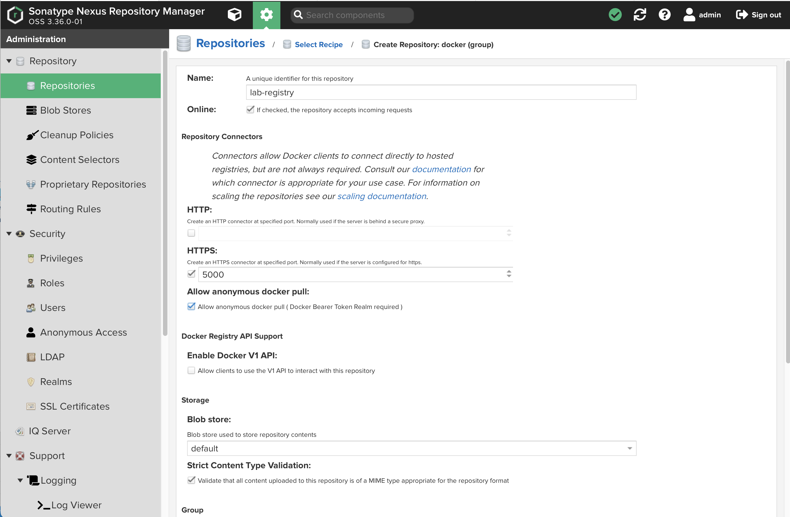

__Note:__ These instructions are superseded with my CLI that I wrote to ease the configuration.  I am retaining these instructions so that the curious among you can see the details behind what the Lab CLI abstracts.

### Installing Nexus on a Raspberry Pi 4B

1. Log onto the Pi:

   ```bash
   ssh root@bastion.${LAB_DOMAIN}
   ```

1. Install Java runtime

   OpenWrt does not include a packaged Java runtime.  So, we are going to borrow one from Alpine Linux.

   1. Grab the packages and unpack them:

      ```bash
      mkdir /tmp/work-dir
      cd /tmp/work-dir

      PKG="openjdk8-8 openjdk8-jre-8 openjdk8-jre-lib-8 openjdk8-jre-base-8 java-cacerts"

      for package in ${PKG}; do
         FILE=$(lftp -e "cls -1 alpine/edge/community/aarch64/${package}*; quit" http://dl-cdn.alpinelinux.org)
         curl -LO http://dl-cdn.alpinelinux.org/${FILE}
      done

      for i in $(ls)
      do
         tar xzf ${i}
      done
      ```

   1. Move the package files to the proper install locations:

      ```bash
      mv ./usr/lib/jvm/java-1.8-openjdk /usr/local/java-1.8-openjdk
      ```

   1. Add Java to the `PATH`

      ```bash
      export PATH=${PATH}:/root/bin:/usr/local/java-1.8-openjdk/bin
      echo "export PATH=\$PATH:/root/bin:/usr/local/java-1.8-openjdk/bin" >> /root/.profile
      ```

   1. The installed `cacerts` file is empty, so we need to import the certs from the OS.

      ```bash
      opkg update
      opkg install ca-certificates
      
      rm -f /usr/local/java-1.8-openjdk/jre/lib/security/cacerts
      keytool -noprompt -importcert -file /etc/ssl/certs/ca-certificates.crt -keystore /usr/local/java-1.8-openjdk/jre/lib/security/cacerts -keypass changeit -storepass changeit


      for i in $(find /etc/ssl/certs -type f)
      do
        ALIAS=$(echo ${i} | cut -d"/" -f5)
        keytool -noprompt -importcert -file ${i} -alias ${ALIAS}  -keystore /usr/local/java-1.8-openjdk/jre/lib/security/cacerts -keypass changeit -storepass changeit
      done
      ```

   1. Finally, clean up:

      ```bash
      cd
      rm -rf /tmp/work-dir
      ```

1. Install Sonatype Nexus OSS

   ```bash
   mkdir -p /usr/local/nexus/home
   cd /usr/local/nexus
   wget https://download.sonatype.com/nexus/3/latest-unix.tar.gz -O latest-unix.tar.gz
   tar -xzf latest-unix.tar.gz
   NEXUS=$(ls -d nexus-*)
   ln -s ${NEXUS} nexus-3
   rm -f latest-unix.tar.gz
   ```

1. Add a user for Nexus:

   ```bash
   groupadd nexus
   useradd -g nexus -d /usr/local/nexus/home nexus
   chown -R nexus:nexus /usr/local/nexus
   ```

1. Create a service script for Nexus so the OS can start and stop it:

   ```bash
   sed -i "s|#run_as_user=\"\"|run_as_user=\"nexus\"|g" /usr/local/nexus/nexus-3/bin/nexus.rc

   cat <<EOF > /etc/init.d/nexus
   #!/bin/sh /etc/rc.common

   START=99
   STOP=80
   SERVICE_USE_PID=0

   start() {
      ulimit -Hn 65536
      ulimit -Sn 65536
       service_start /usr/local/nexus/nexus-3/bin/nexus start
   }

   stop() {
       service_stop /usr/local/nexus/nexus-3/bin/nexus stop
   }
   EOF

   chmod 755 /etc/init.d/nexus
   ```

1. Configure Nexus to use the JRE that we installed

   ```bash
   sed -i "s|# INSTALL4J_JAVA_HOME_OVERRIDE=|INSTALL4J_JAVA_HOME_OVERRIDE=/usr/local/java-1.8-openjdk|g" /usr/local/nexus/nexus-3/bin/nexus
   ```

1. Before we start Nexus, let's go ahead a set up TLS so that our connections are secure from prying eyes.

   ```bash
   keytool -genkeypair -keystore /usr/local/nexus/nexus-3/etc/ssl/keystore.jks -deststoretype pkcs12 -storepass password -keypass password -alias jetty -keyalg RSA -keysize 4096 -validity 5000 -dname "CN=nexus.${DOMAIN}, OU=okd4-lab, O=okd4-lab, L=Roanoke, ST=Virginia, C=US" -ext "SAN=DNS:nexus.${DOMAIN},IP:${BASTION_HOST}" -ext "BC=ca:true"
   keytool -importkeystore -srckeystore /usr/local/nexus/nexus-3/etc/ssl/keystore.jks -destkeystore /usr/local/nexus/nexus-3/etc/ssl/keystore.jks -deststoretype pkcs12 -srcstorepass password
   rm -f /usr/local/nexus/nexus-3/etc/ssl/keystore.jks.old

   chown nexus:nexus /usr/local/nexus/nexus-3/etc/ssl/keystore.jks
   ```

1. Modify the Nexus configuration for HTTPS:

   ```bash
   mkdir /usr/local/nexus/sonatype-work/nexus3/etc
   cat <<EOF >> /usr/local/nexus/sonatype-work/nexus3/etc/nexus.properties
   nexus-args=\${jetty.etc}/jetty.xml,\${jetty.etc}/jetty-https.xml,\${jetty.etc}/jetty-requestlog.xml
   application-port-ssl=8443
   EOF
   chown -R nexus:nexus /usr/local/nexus/sonatype-work/nexus3/etc
   ```

1. Now we should be able to start Nexus:

   ```bash
   /etc/init.d/nexus enable
   /etc/init.d/nexus start
   ```

1. Nexus will take a while to start for the first time.

   Go make a nice cup of tea, coffee, or hot beverage of your choice.  Nexus will be up shortly.

1. After Nexus has started, trust the new Nexus cert on your workstation:

   * Mac OS:

     ```bash
     openssl s_client -showcerts -connect nexus.${LAB_DOMAIN}:8443 </dev/null 2>/dev/null|openssl x509 -outform PEM > /tmp/nexus.${LAB_DOMAIN}.crt
     sudo security add-trusted-cert -d -r trustRoot -k "/Library/Keychains/System.keychain" /tmp/nexus.${LAB_DOMAIN}.crt
     ```

   * Linux:

     ```bash
     openssl s_client -showcerts -connect nexus.${LAB_DOMAIN}:5001 </dev/null 2>/dev/null > /tmp/nexus.${LAB_DOMAIN}.cert
     sudo openssl x509 -outform PEM -in /tmp/nexus.${LAB_DOMAIN}.cert -out /etc/pki/ca-trust/source/anchors/nexus.${LAB_DOMAIN}.crt
     rm /tmp/nexus.${LAB_DOMAIN}.cert
     sudo update-ca-trust
     ```

### Set up Nexus for image mirroring:

Now point your browser to `https://nexus.${LAB_DOMAIN}:8443`.  Login, and create a password for your admin user.

If prompted to allow anonymous access, select to allow.

The `?` in the top right hand corner of the Nexus screen will take you to their documentation.

1. We need to create a hosted Docker registry to hold the mirror of the OKD images that we will use to install our cluster.

   1. Login as your new admin user

   1. Select the gear icon from the top bar, in between a cube icon and the search dialog.

   1. Select `Repositories` from the left menu bar.

      

   1. Select `+ Create repository`

   1. Select `docker (hosted)`

      

   1. Name your repository `okd`

   1. Check `HTTPS` and put `5001` in the port dialog entry

   1. Check `Allow anonymous docker pull`

      

   1. Click `Create repository` at the bottom of the page.

1. Next we need to create a Proxy registry for `gcr.io`.  We'll need this later on for Tekton.

   1. Select `Repositories` from the left menu bar.

   1. Select `+ Create repository`

   1. Select `docker (proxy)`

   1. Name your repository `gcr-io`

   1. Check `Allow anonymous docker pull`

   1. Set `https://gcr.io` as the `Remote storage` location.

      

   1. Click `Create repository` at the bottom of the page.

1. Finally, create a Group registry as an umbrella for the hosted and proxy registries.

   1. Select `Repositories` from the left menu bar.

   1. Select `+ Create repository`

   1. Select `docker (group)`

   1. Name your repository `lab-registry`

   1. Check `HTTPS` and put `5000` in the port dialog entry

   1. Check `Allow anonymous docker pull`

   1. Set `https://gcr.io` as the `Remote storage` location.

      

   1. Add your other two registries as group members:

      

   1. Click `Create repository` at the bottom of the page.

1. Now expand the `Security` menu on the left and select `Realms`

   1. Add `Docker Bearer Token Realm` to the list of active `Realms`

      

   1. Click `Save`

1. Now, select `Roles` from the expanded `Security` menu on the left.

   1. Click `+ Create role` and select `Nexus role`

   1. Create the role as shown:

      

   1. Add the appropriate privileges as shown:

      

   1. Click `Create role`

1. Now, select `Users` from the expanded `Security` menu on the left.

    

   1. Click `Create local user`

   1. Create the user as shown:

      
