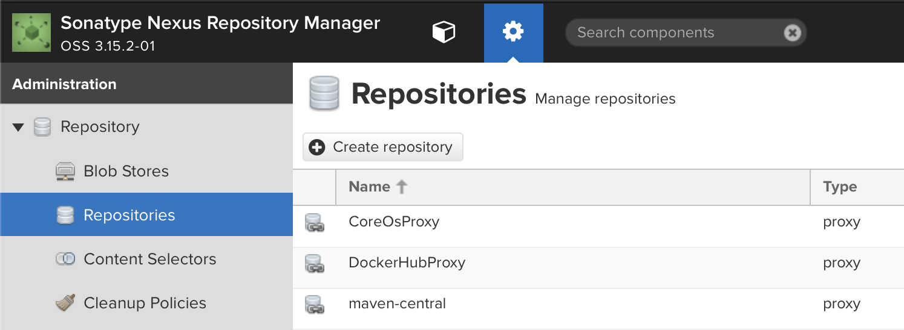
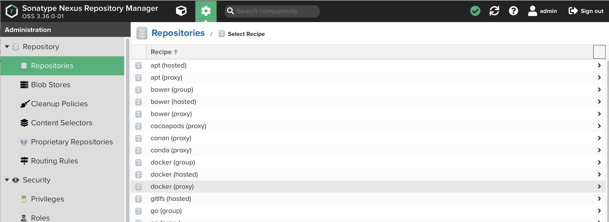
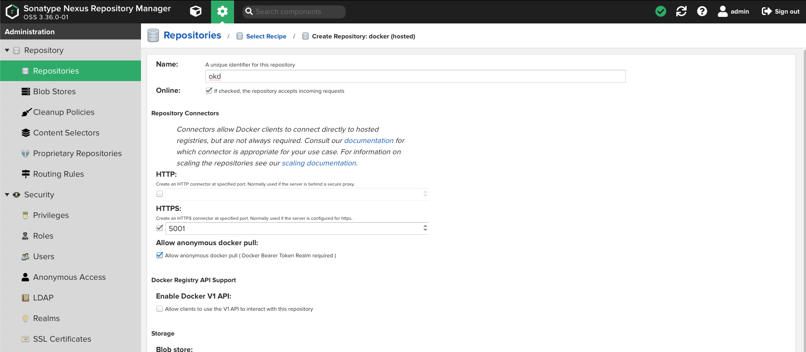
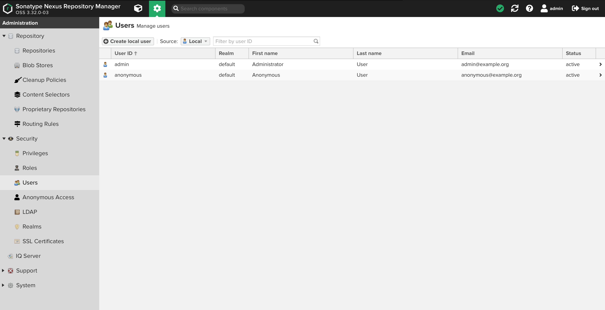

We are now going to set up the following capabilities for your OpenShift home lab:

* OpenWRT Router #1 (GL.iNet GL-MV1000W Travel Router)
  * Edge internet access
  * Edge DNS services
  * Edge Firewall
  * Wireless access to your lab
* OpenWRT Router #2 (GL.iNet GL-MV1000 Travel Router)
  * PXE Boot for bare metal hosts and for OpenShift nodes
  * Internal Lab DNS Server
  * Internal Firewall
  * HA-Proxy Network Load Balancer for the OpenShift cluster
* OpenWRT Bastion Server (Raspberry Pi 4b 8GB)
  * CentOS Stream repository mirror
  * Sonatype Nexus - Registry and Artifact Repository
  * Gitea - Source Code Management

The network topology will look like this illustration:


All of these devices will be running the OpenWRT linux distribution. Find out more here: [https://openwrt.org](https://openwrt.org)

### Configure the Edge Router

1. If you don't have an SSH key pair configured on your workstation, then create one now:

   ```bash
   ssh-keygen -t rsa -b 4096 -N "" -f ${HOME}/.ssh/id_rsa
   ```

1. Connect to your edge router:

   Do not connect your router to any other network devices yet.

   Power it on and connect to it from your workstation.

   With the `GL-MV1000W` you can connect to the WiFi.  The initial SSID and passphrase are on the back of the router.

   Otherwise, connect from your workstation with a network cable.  I generally use a network cable to apply the initial configuration to my GL.iNet routers.

   Ensure that you can ping the router: `ping 192.168.8.1`

1. Initialize the router configuration:

   You can use the GL.iNet GL-MV1000W either as an access point, or as an access point plus repeater for wireless connection to your home network.

   I highly recommend using a cable to connect the router to your home network.  You will get much faster network speeds than you get in repeater mode.  But, the repeater mode is usable.  Especially when traveling.

   __To use the router with a wired connection to your home network, do this:__

   ```bash
   initRouter.sh -e -wl
   ```

   You will prompted to enter an `SSID` and a passphrase for your new lab network.

   __To use the router in repeater mode, do this instead:__

   ```bash
   initRouter.sh -e -wl -ww
   ```

   You will prompted to enter the `SSID` and passphrase for home wireless network, and you will prompted to enter an `SSID` and a passphrase for your new lab network.

   When the configuration is complete, the router will reboot.

1. Finish configuring the router:

   Now, connect the router to your home network if you are not using the wireless-repeater mode.

   At this point you should be able to connect your workstation to your new lab WiFi network.

   Finish the configuration:

   ```bash
   configRouter.sh -e
   ```

   __Note:__   If you want to see the details of what the init and config scripts are doing, I have a page with the manual instructions here: [Edge Network Router Configuration](/home-lab/edge-router/)

### Configure the Internal Network Router

This configuration is very similar to setting up the edge router.

1. Connect to your internal network router:

   Do not connect your router to any other network devices yet.

   Power it on and connect to it from your workstation with a network cable.

   Ensure that you can ping the router: `ping 192.168.8.1`

1. Initialize the router configuration:

   ```bash
   initRouter.sh -d=sno
   ```

   When the configuration is complete, the router will reboot.

1. Finish the router configuration:

   Connect the internal router WAN port to one of the two LAN ports on the edge router.
  
   The WAN port is the left most port.

   Ensure that you can connect to the router:

   ```bash
   ping router.sno.my.awesome.lab
   ```

   Now, complete the router configuration:

   ```bash
   configRouter.sh -d=sno
   ```

   When the configuration is complete, the router will reboot.

   __Note:__  If you want to see the details of what the init and config scripts are doing, I have a page with the manual instructions here: [Internal Network Router Configuration](/home-lab/internal-router/) 

### Configure the Raspberry Pi

We are going to use the edge router that we set up previously to configure the OS for the Raspberry Pi.

1. Insert the SD Card into the edge router.

1. Install and configure OpenWRT on the SD Card:

   ```bash
   initPi.sh
   ```

   This will take a while to complete.

1. Remove the SD Card from the edge router and insert it into the Pi.

1. Connect the network adapter from the Pi to the other LAN port on the edge router.

1. Power on the Pi.

1. Ensure that they Pi is on line:

   ```bash
   ping bastion.my.awesome.lab
   ```

1. Complete the configuration of the Pi:

   ```bash
   configPi.sh -s
   ```

   When the configuration is complete, the Pi will reboot.

1. Install Sonatype Nexus and Gitea

   ```bash
   configPi.sh -n
   configPi.sh -g
   ```

1. Nexus will take a while to start for the first time.

   Go make a nice cup of tea, coffee, or hot beverage of your choice.  Nexus will be up shortly.

1. After Nexus has started, trust the new Nexus cert on your workstation:

   * Mac OS:

     ```bash
     openssl s_client -showcerts -connect nexus.${LAB_DOMAIN}:8443 </dev/null 2>/dev/null|openssl x509 -outform PEM > /tmp/nexus.${LAB_DOMAIN}.crt
     sudo security add-trusted-cert -d -r trustRoot -k "/Library/Keychains/System.keychain" /tmp/nexus.${LAB_DOMAIN}.crt
     ```

   * Linux:

     ```bash
     openssl s_client -showcerts -connect nexus.${LAB_DOMAIN}:5001 </dev/null 2>/dev/null > /tmp/nexus.${LAB_DOMAIN}.cert
     sudo openssl x509 -outform PEM -in /tmp/nexus.${LAB_DOMAIN}.cert -out /etc/pki/ca-trust/source/anchors/nexus.${LAB_DOMAIN}.crt
     rm /tmp/nexus.${LAB_DOMAIN}.cert
     sudo update-ca-trust
     ```

1. Trust the gitea certs on your workstation:

   * Mac OS:

     ```bash
     openssl s_client -showcerts -connect gitea.${LAB_DOMAIN}:3000 </dev/null 2>/dev/null|openssl x509 -outform PEM > /tmp/gitea.${LAB_DOMAIN}.crt
     sudo security add-trusted-cert -d -r trustRoot -k "/Library/Keychains/System.keychain" /tmp/gitea.${LAB_DOMAIN}.crt
     ```

   * Linux:

     ```bash
     openssl s_client -showcerts -connect gitea.${LAB_DOMAIN}:3000 </dev/null 2>/dev/null|openssl x509 -outform PEM > /etc/pki/ca-trust/source/anchors/gitea.${LAB_DOMAIN}.crt
     update-ca-trust
     ```

   The Gitea web console will be at: `https://gitea.${LAB_DOMAIN}:3000`

   The script creates two users for Gitea:

   1. `gitea` - This is your Gitea admin user
   1. `devuser` - This is a non-privileged user for Gitea.

   Both passwords are initialized to `password`.  You will be prompted to change them when you log in.

### Set up Nexus for image mirroring:

Now point your browser to `https://nexus.${LAB_DOMAIN}:8443`.  Login, and create a password for your admin user.

If prompted to allow anonymous access, select to allow.

The `?` in the top right hand corner of the Nexus screen will take you to their documentation.

1. We need to create a hosted Docker registry to hold the mirror of the OKD images that we will use to install our cluster.

   1. Login as your new admin user

   1. Select the gear icon from the top bar, in between a cube icon and the search dialog.

   1. Select `Repositories` from the left menu bar.

      

   1. Select `+ Create repository`

   1. Select `docker (hosted)`

      

   1. Name your repository `okd`

   1. Check `HTTPS` and put `5001` in the port dialog entry

   1. Check `Allow anonymous docker pull`

      

   1. Click `Create repository` at the bottom of the page.

1. Next we need to create a Proxy registry for `gcr.io`.  We'll need this later on for Tekton.

   1. Select `Repositories` from the left menu bar.

   1. Select `+ Create repository`

   1. Select `docker (proxy)`

   1. Name your repository `gcr-io`

   1. Check `Allow anonymous docker pull`

   1. Set `https://gcr.io` as the `Remote storage` location.

      

   1. Click `Create repository` at the bottom of the page.

1. Finally, create a Group registry as an umbrella for the hosted and proxy registries.

   1. Select `Repositories` from the left menu bar.

   1. Select `+ Create repository`

   1. Select `docker (group)`

   1. Name your repository `lab-registry`

   1. Check `HTTPS` and put `5000` in the port dialog entry

   1. Check `Allow anonymous docker pull`

   1. Set `https://gcr.io` as the `Remote storage` location.

      

   1. Add your other two registries as group members:

      

   1. Click `Create repository` at the bottom of the page.

1. Now expand the `Security` menu on the left and select `Realms`

   1. Add `Docker Bearer Token Realm` to the list of active `Realms`

      

   1. Click `Save`

1. Now, select `Roles` from the expanded `Security` menu on the left.

   1. Click `+ Create role` and select `Nexus role`

   1. Create the role as shown:

      

   1. Add the appropriate privileges as shown:

      

   1. Click `Create role`

1. Now, select `Users` from the expanded `Security` menu on the left.

    

   1. Click `Create local user`

   1. Create the user as shown:

      

We're now ready to start the installation of SNO.

[Deploy a Single Node Cluster](/home-lab/bare-metal-install-sno/)
