__Note:__  __*If you have not installed Gitea, you need to do that first*__: [Install Gitea](/home-lab/gitea-with-pi/)

### Set up a Gitea organization and service account for the demo application:

1. Log into gitea as your admin user:

   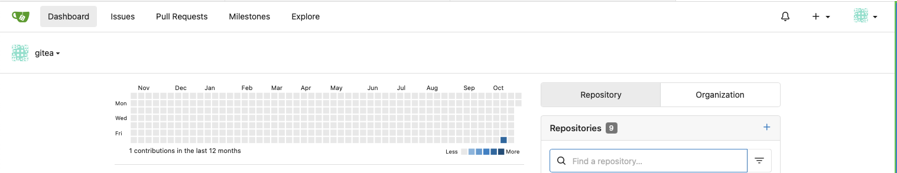

1. Select `Site Administration` from the drop down menu in the top right corner:

   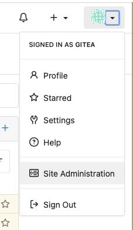

1. Select User Accounts:

   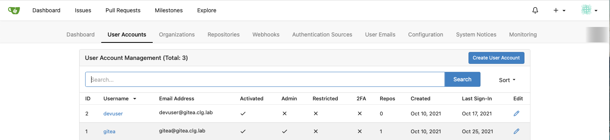

1. Create a Service Account for our demo:

    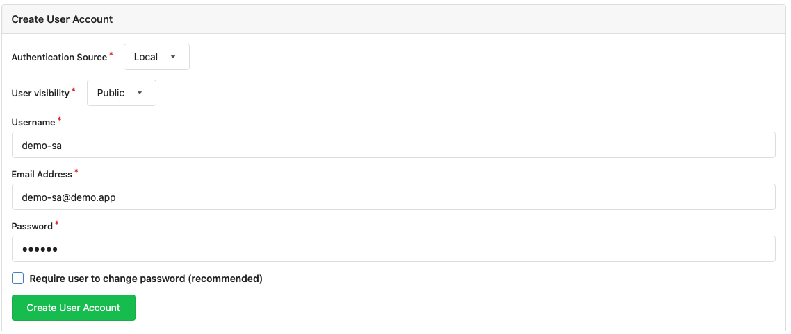

1. Update the service account by unchecking `May Create Organizations`

   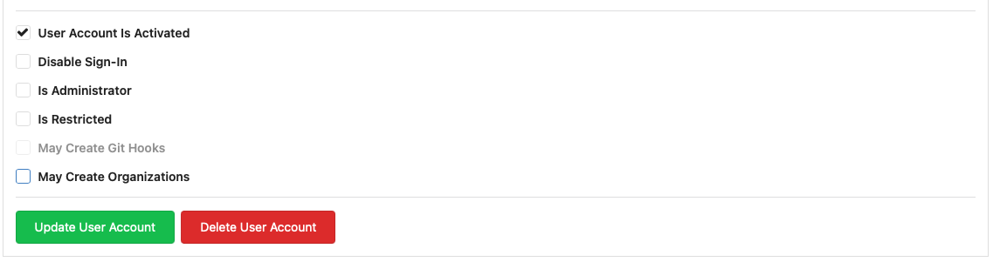

1. Go back to `Site Administration` and select `Organizations`:

   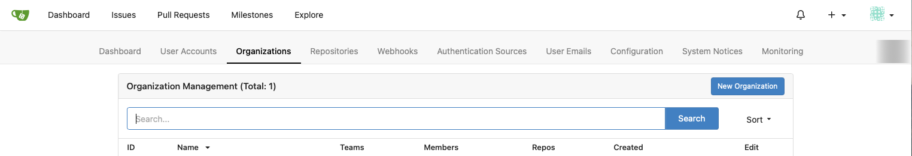

1. Create an Organization for the demo code:

   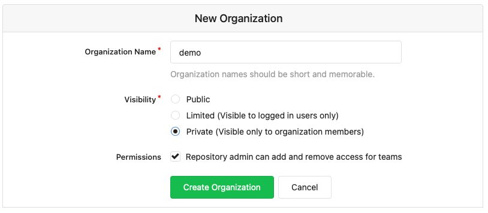

1. From the new Organization, select the `Owners` Team from the `Teams` menu on the right hand of the screen:

   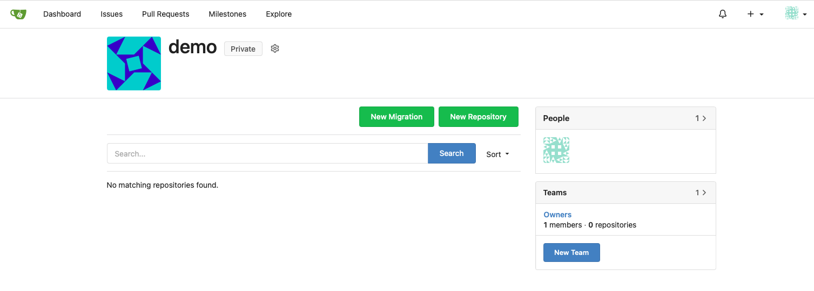

1. Add your `devuser` account as a Team member:

   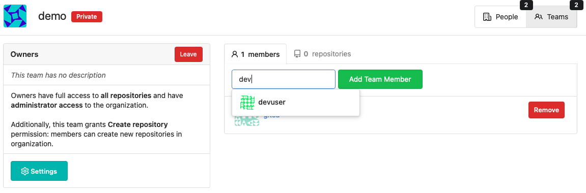

1. Go back to the `demo` Organization and this time select `New Team` from the right hand menu:

   Create a team as shown for the demo service account:

   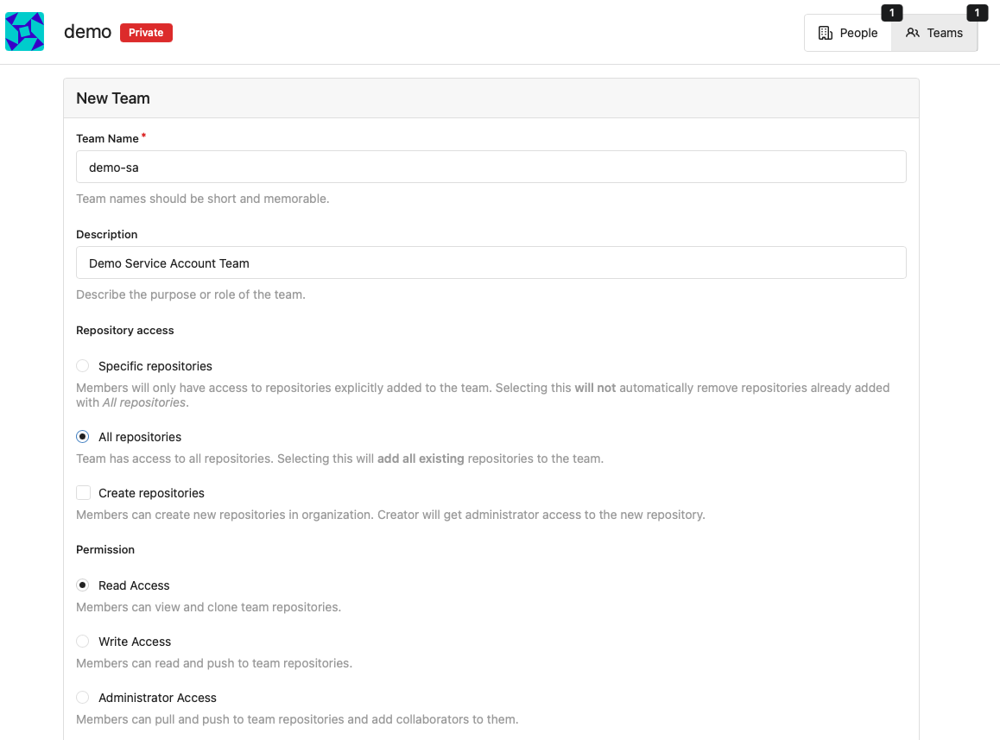
   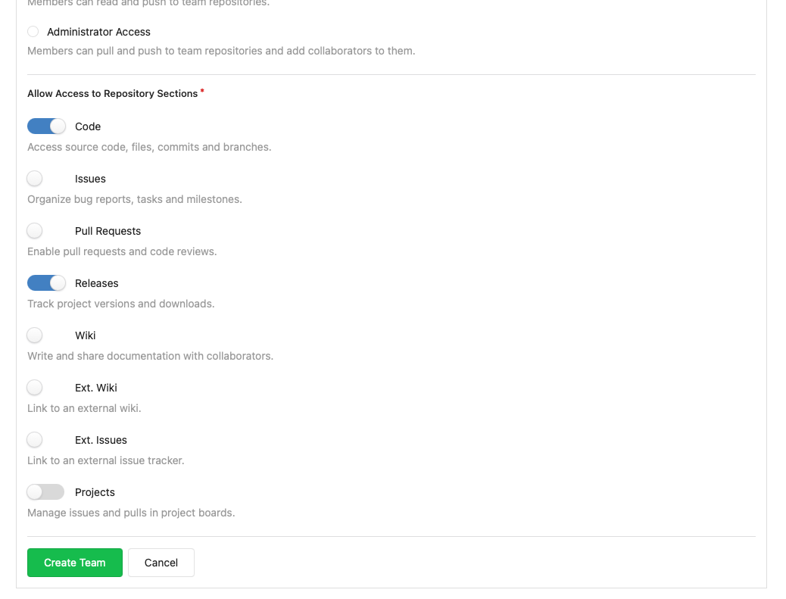

1. Go back to the `demo` Organization and select the new `demo-sa` Team from the right hand menu:

   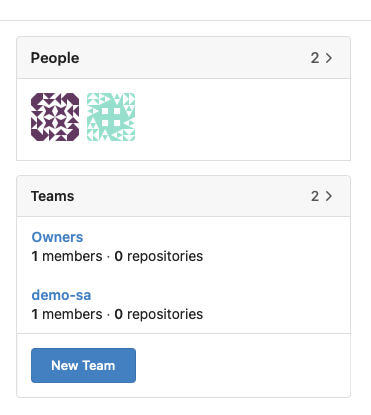

1. Add the `demo-sa` user to the Team:

   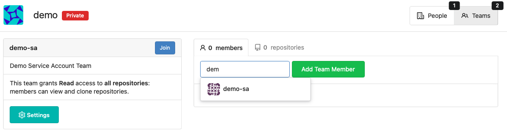

__Now that Gitea is ready to play its part in our development ecosystem, let's get an OpenShift project set up:__

__[Tekton Pipelines - OpenShift Project Setup](/home-lab/pipelines-project-setup/)__
