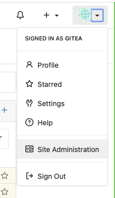
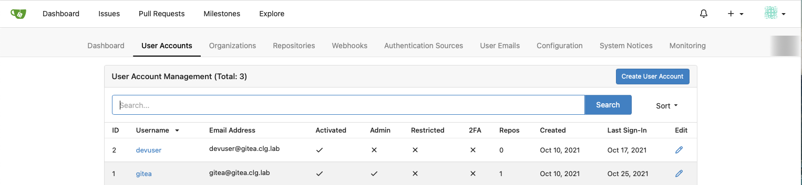
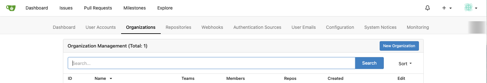
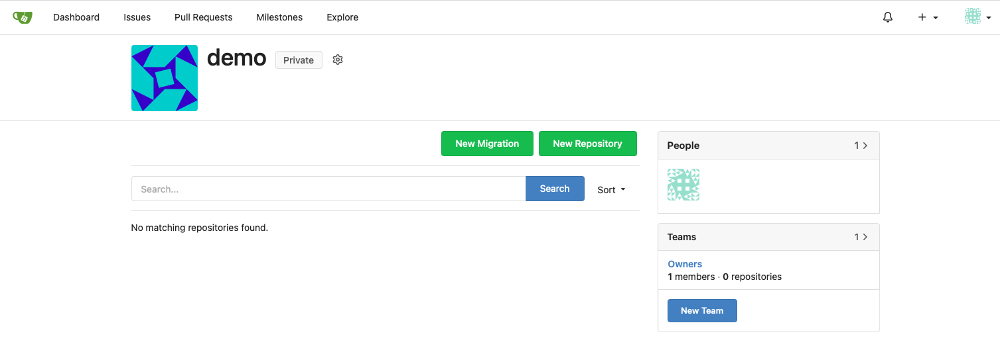
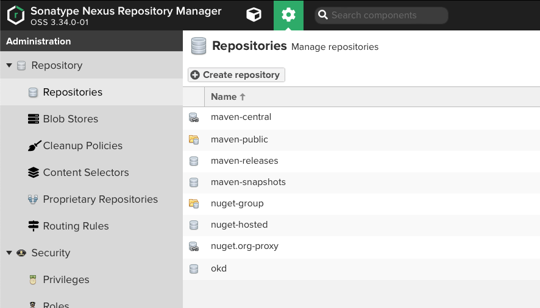

Now, let's do a quick demonstration of the capabilities of Tekton and Tekton Triggers.  In a later post, I'll show you how to automate this setup across your whole cluster.

1. Create an OpenShift project for our demonstration:

   ```bash
   oc login https://api.okd4.dev.${LAB_DOMAIN}:6443
   oc new-project app-demo
   ```

1. Create a maven settings.xml file for your maven builds:

   Remember, our OpenShift cluster is on a disconnected network.  This means that our Java builds will not be able to access Maven Central directly.  So, we will leverage Nexus as a maven mirror.  Nexus comes configured, out of the box, with a proxy for Maven Central already configured.  We will leverage that.

   This ConfigMap will be mounted as a volume by our Tekton Task that builds Java applications.

   ```bash
   cat << EOF | oc apply -n app-demo -f -
   apiVersion: v1
   kind: ConfigMap
   metadata:
     name: maven-settings-xml
   data:
     settings.xml: |
       <?xml version="1.0" encoding="UTF-8"?>
       <settings>
         <mirrors>
           <mirror>
             <id>maven-public</id>
             <name>maven-public</name>
             <url>https://nexus.${LAB_DOMAIN}:8443/repository/maven-public/</url>
             <mirrorOf>*</mirrorOf>
           </mirror>
         </mirrors>
         <profiles>
           <profile>
             <id>maven-nexus-repo</id>
             <repositories>
               <repository>
                 <id>maven-public</id>
                 <name>maven-public</name>
                 <url>https://nexus.${LAB_DOMAIN}:8443/repository/maven-public/</url>
               </repository>
             </repositories>
           </profile>
         </profiles>
         <activeProfiles>
           <activeProfile>maven-nexus-repo</activeProfile>
         </activeProfiles>
       </settings>
   EOF
   ```

1. Install the pipelines resources:

   ```bash
   oc apply -f ${OKD_LAB_PATH}/okd-home-lab/pipelines/manifests/ -n app-demo
   ```

1. Create an authentication secret so that the pipeline service account can access gitea with the credentials we created above:

   Place the credentials into environment variables.  We're using the `read` shell command so that the username and password are not stored in the shell history.

   ```bash
   read -s GITEA_USER
   ```

   Type the service account user name that we created above and hit `retrun`:

   ```bash
   read -s GITEA_PASSWD
   ```

   Type the service account password that we created above and hit `retrun`:

   Now create a Kubernetes Secret with this information:

   ```bash
   cat << EOF | oc apply -n app-demo -f -
   apiVersion: v1
   kind: Secret
   metadata:
       name: gitea-secret
       annotations:
         tekton.dev/git-0: https://gitea.${LAB_DOMAIN}:3000
   type: kubernetes.io/basic-auth
   data:
     username: $(echo -n ${GITEA_USER} | base64)
     password: $(echo -n ${GITEA_PASSWD} | base64)
   EOF

   oc patch sa pipeline --type json --patch '[{"op": "add", "path": "/secrets/-", "value": {"name":"gitea-secret"}}]' -n app-demo
   ```

   Clear the environment variables:

   ```bash
   GITEA_USER=""
   GITEA_PASSWD=""
   ```

### Set up a Gitea organization and service account for the demo application:

1. Log into gitea as your admin user:

   

1. Select `Site Administration` from the drop down menu in the top right corner:

   

1. Select User Accounts:

   

1. Create a Service Account for our demo:

    

1. Update the service account by unchecking `May Create Organizations`

   

1. Go back to `Site Administration` and select `Organizations`:

   

1. Create an Organization for the demo code:

   

1. From the new Organization, select the `Owners` Team from the `Teams` menu on the right hand of the screen:

   

1. Add your `devuser` account as a Team member:

   

1. Go back to the `demo` Organization and this time select `New Team` from the right hand menu:

   Create a team as shown for the demo service account:

   
   

1. Go back to the `demo` Organization and select the new `demo-sa` Team from the right hand menu:

   

1. Add the `demo-sa` user to the Team:

   

### Enable Nexus to act as a proxy for Maven Central:

1. Log into your Nexus server on the bastion Pi as your `admin` user:

   `https://nexus.${LAB_DOMAIN}:8443`

1. Select the `Gear` icon to enter the `Administration` menu:

   

1. Navigate to `Repository` -> `Repositories`:

   

1. Select the `maven-central` repository:

   Check `Use Nexus Trust Store`:

   

1. Click on `View certificate` and then click on `Add certificate to truststore`

1. Click `Save` at the bottom of the page.
