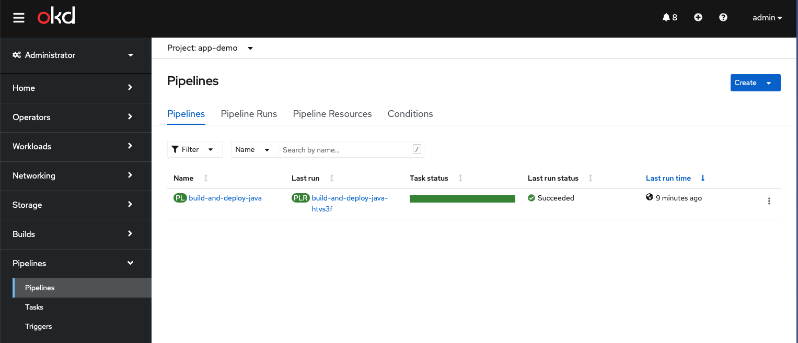

### Create the demo application:

Let's do a quick demonstration of the capabilities of Tekton, Tekton Triggers & Gitea webhooks.

1. Initialize the demo application:

   ```bash
   cd ${OKD_LAB_PATH}
   mvn io.quarkus:quarkus-maven-plugin:2.4.1.Final:create -DprojectGroupId=fun.is.quarkus -DprojectArtifactId=app-demo -DclassName="fun.is.quarkus.AppDemo" -Dpath="/hello" -Dextensions="quarkus-resteasy-jackson"
   ```

1. Initialize git tracking for the application:

   ```bash
   cd ${OKD_LAB_PATH}/app-demo
   git init
   git branch -m trunk
   git add .
   git commit -m "init"
   ```

1. Create the `app-demo` git repository on the gitea server:

   ```bash
   git remote add origin https://gitea.${LAB_DOMAIN}:3000/demo/app-demo
   git push --set-upstream origin trunk
   ```

1. Create the pipeline components:

   ```bash
   oc process app-demo//create-rolling-replace-quarkus-fast-jar-app -p GIT_REPOSITORY=https://gitea.${LAB_DOMAIN}:3000/demo/app-demo -p GIT_BRANCH=trunk | oc apply -n app-demo -f -
   ```

1. Make a code change to the project:

   ```bash
   echo "test-1" >> test.txt
   git add .
   git commit -m test-1
   git push
   ```

1. Watch the pipeline that was just triggered!

   
