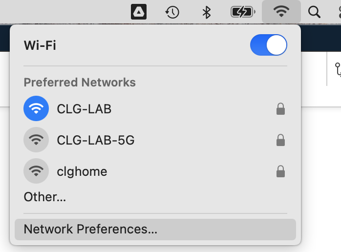
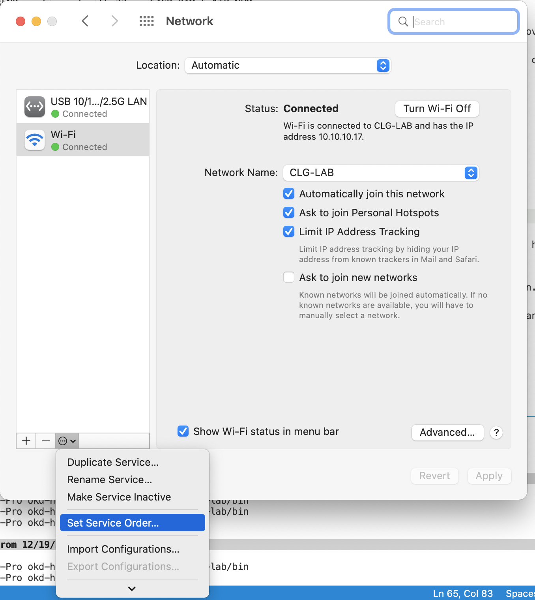
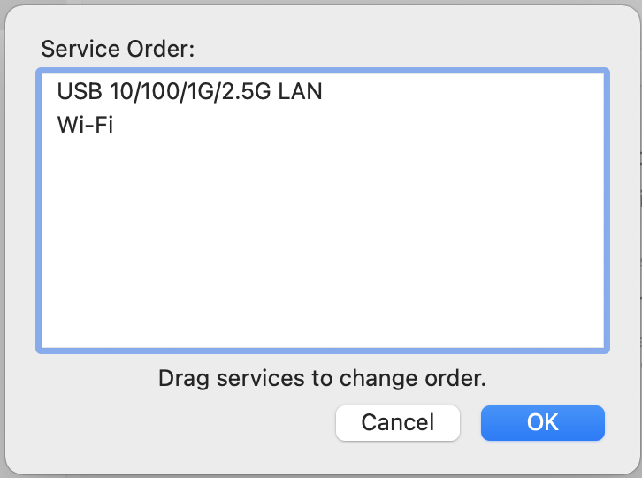
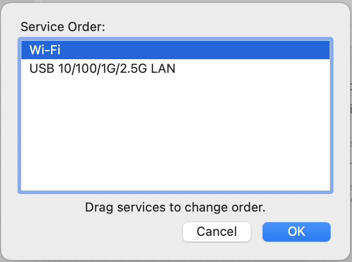

Let's set up a MacBook to run the OpenShift Bootstrap node.

1. Install Qemu and some dev tools.

   _Note:_ You will likely have to install Xcode CLI tools.

   ```bash
   brew install qemu autoconf automake wolfssl
   ```

1. Plug in your USB-C network adapter and identify the device:

   1. Run this to list all of your devices:

      ```bash
      networksetup -listallhardwareports
      ```

   1. Look for the USB entry:

      Mine looked like this:

      ```bash
      Hardware Port: USB 10/100/1G/2.5G LAN
      Device: en6
      Ethernet Address: 00:e0:4c:84:ca:aa
      ```

   1. Note the `Device` name, and set a variable:

      ```bash
      export BOOTSTRAP_BRIDGE=en6
      ```

1. Set your WiFi to be the primary internet link:

   1. Click on the wifi icon in the top right of your screen.

      

   1. In the bottom left of the pop up, select the menu dropdown and click on `Set Service Order`

      

   1. Drag `WiFi` to the top.

      

      

   1. Click `OK` then click `Apply`

1. Now, install VDE for bridged networking:

   ```bash
   mkdir -p ${OKD_LAB_PATH}/work-dir
   cd ${OKD_LAB_PATH}/work-dir
   git clone https://github.com/virtualsquare/vde-2.git
   cd vde-2
   autoreconf -fis
   ./configure --prefix=/opt/vde
   make
   sudo make install
   ```

1. Finally, set up the network bridge device:

   ```bash
   cd ${OKD_LAB_PATH}/work-dir
   git clone https://github.com/lima-vm/vde_vmnet
   cd vde_vmnet
   make PREFIX=/opt/vde
   sudo make PREFIX=/opt/vde install
   sudo make install BRIDGED=${BOOTSTRAP_BRIDGE}
   ```

### Resetting The Bridge Device

It will be necessary to reset the bridge device from time to time after a reboot, or unplugging the NIC.

```bash
labcli --reset-nic
```
