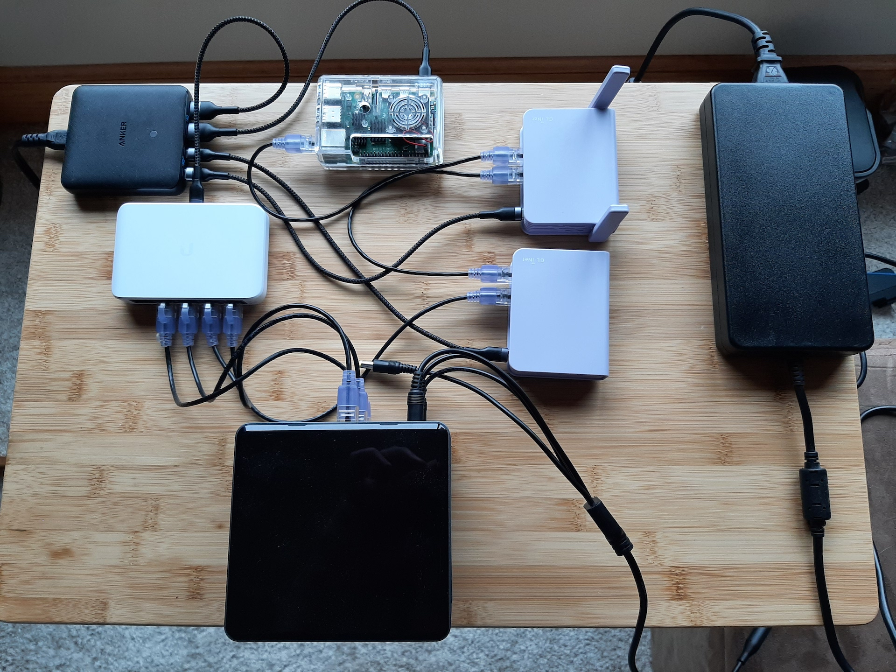
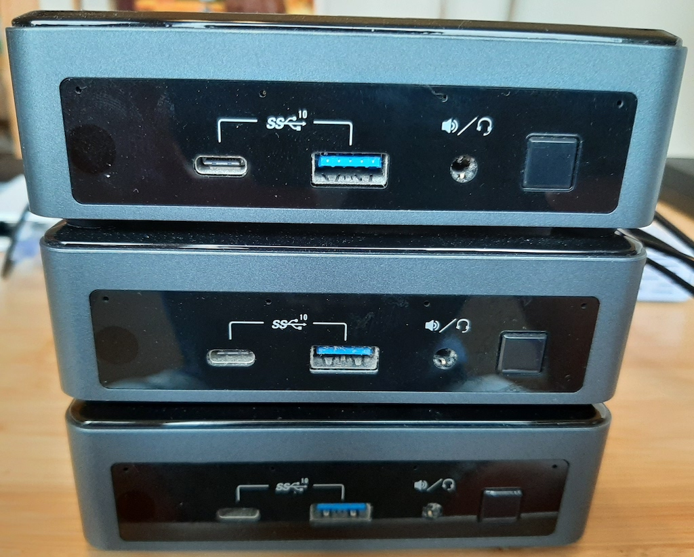
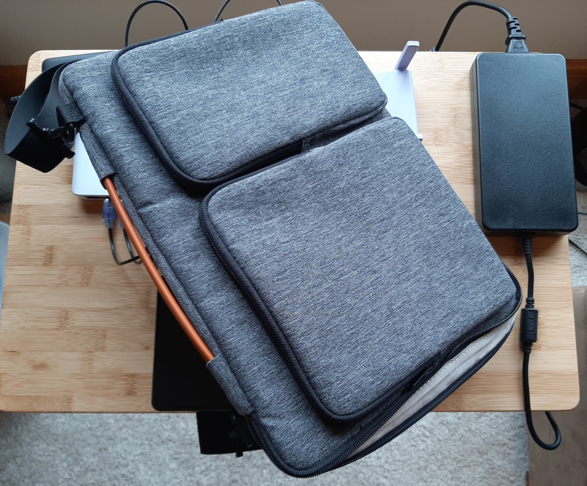

Below is the complete bill of materials for your starter lab.

### Base Network Gear

I've included Amazon.com links to the gear that I have.

__Note: GL.iNet has discontinued both the GL-MV1000, and the GL-MV1000W.__

I have added support for the [GL-AR750S-Ext](https://www.amazon.com/GL-iNet-GL-AR750S-Ext-pre-Installed-Cloudflare-Included/dp/B07GBXMBQF/ref=sr_1_3?dchild=1&keywords=gl.iNet&qid=1627902663&sr=8-3){:target="_blank"} as your edge router.  But it is not capable enough to be your domain router which needs more memory and CPU to serve both DNS and HA-Proxy.

I am working on adding support for the [Nanopi R4S](https://www.friendlyelec.com/index.php?route=product/product&product_id=284){:target="_blank"}.  It is even more capable than the GL-MV1000.  Unfortunately, the chip shortage has made things difficult to acquire.

* [GL.iNet GL-MV1000W](https://www.amazon.com/gp/product/B08DCFBV3H/ref=ppx_yo_dt_b_search_asin_title?ie=UTF8&psc=1){:target="_blank"} (Edge Router with WiFi)
  * __Note:__ You may also be able to use the less expensive [GL.iNet GL-AR750S-Ext](https://www.amazon.com/GL-iNet-GL-AR750S-Ext-pre-Installed-Cloudflare-Included/dp/B07GBXMBQF/ref=sr_1_3?dchild=1&keywords=gl.iNet&qid=1627902663&sr=8-3){:target="_blank"}  But, while it has dual-band WiFi, it is much more limited on internal storage, CPU, and RAM.
  * If you go with this option, you will also need a USB type A thumb drive with at least 2GB capacity.
* [GL.iNet GL-MV1000](https://www.amazon.com/gp/product/B07ZJD5BZY/ref=ppx_yo_dt_b_search_asin_title?ie=UTF8&psc=1){:target="_blank"} (Internal Router)
  * __Note:__ The GL-AR750S-Ext will not work for this function.
* [Raspberry Pi 4b 8GB](https://www.amazon.com/gp/product/B089ZZ8DTV/ref=ppx_yo_dt_b_search_asin_title?ie=UTF8&psc=1){:target="_blank"} (Bastion Host)
* [SD Card for the Pi](https://www.amazon.com/gp/product/B08RG6XJZD/ref=ppx_yo_dt_b_search_asin_title?ie=UTF8&psc=1){:target="_blank"}
* [Anker 65W 4 Port PIQ 3.0 & GaN Fast Charger Adapter](https://www.amazon.com/Anker-Charger-4-Port-MacBook-Laptops/dp/B098WQRGNQ/ref=dp_prsubs_1?pd_rd_i=B098WQRGNQ&psc=1){:target="_blank"}
  * __Note:__ I use this Anker power supply to run the routers and Pi off of one brick.  It saves valuable bag space when traveling.
* [USB C cables](https://www.amazon.com/gp/product/B08R68T84N/ref=ppx_yo_dt_b_search_asin_title?ie=UTF8&psc=1){:target="_blank"}
* [USB A to USB C cables](https://www.amazon.com/gp/product/B08T5VXQN3/ref=ppx_yo_dt_b_search_asin_title?ie=UTF8&psc=1){:target="_blank"}
* [Network Cables](https://www.amazon.com/gp/product/B07958727H/ref=ppx_yo_dt_b_search_asin_title?ie=UTF8&psc=1){:target="_blank"}

## Select your Lab Type

* __KVM Based Lab__

   Your Intel Nuc servers will be configured with Qemu/KVM.  The OpenShift cluster nodes will be deployed as virtual machines

* __Single Node Lab__

   You will use one Intel NUC to deploy a Single Node OpenShift instance.  The gear for this lab is identical to the KVM based lab.

   __Note:__ You only need one Intel NUC.

* __Bare Metal Lab__

   You will need at least 3 Intel NUC servers.  The OpenShift cluster will be deployed on bare metal servers.  Each NUC will be an independent OpenShift node.

   __Note:__ The initial cluster will be deployed with combination control-plane/compute nodes.  If you want to separate the control-plane from compute nodes, you will need additional NUCs.

__Note:__ You can combine KVM and Bare Metal configurations.  For example, you can deploy your control-plane on a single NUC with KVM, and then add bare metal compute nodes.

## __Basic KVM or Single Node__

* Intel NUC10i7FNK configured with 64GB RAM, (2 X 32GB) & 1TB NVMe

   Other NUC models will work as well.  The key is to have at least 4 cores.  The slim models are much more portable, so I tend to prefer those.  I love the NUC10i7FNK because it has 6 cores.  That's 12 vCPUs for your lab!!!
   Prices fluctuate so much on the NUCs, M2 NVMe, and RAM that I am not listing any links here.  But I get most of my compute gear from [B&H Photo Video](https://www.bhphotovideo.com), or Amazon.com.  __Note:__ I am not an affiliate with either outlet, so no kickbacks here.

   If you want to deploy a lab with separate control-plane and compute nodes, then you will need at least 2 NUCs.

### Here is a picture of the complete set up

## __Bare Metal__

Let's ditch the hypervisor and put our lab right on the metal!

This project is not for the faint of heart.  It will require some investment.  You are going to need at least 3 Intel NUC machines with a minimum of 2 cores and 32GB RAM each.

With the following list of parts, you will be able to power your cluster off of two power supplies, and pack the whole thing up in a slim 15" laptop bag.

It will look like this:

* [Network adapter for your workstation](https://www.amazon.com/gp/product/B08VN3DGK6/ref=ppx_yo_dt_b_search_asin_title?ie=UTF8&psc=1){:target="_blank"}
  * __Note:__ You will not be able to use the WiFi in your MacBook for the bootstrap network bridge.  We'll need a physical adapter.
* [Gigabit Network Switch](https://www.bhphotovideo.com/c/product/1614892-REG/ubiquiti_networks_usw_flex_mini_unifi_usw_flex_mini.html){:target="_blank"}
* 3 X Intel NUC10i3FNK configured with 32 or 64GB RAM & 1TB NVMe

   Other NUC models will work as well.  The slim models are much more portable, so I tend to prefer those.  I really love the NUC10i7FNK because it has 6 cores.  That's 12 vCPUs for your nodes!!!
   Prices fluctuate so much on the NUCs, M2 NVMe, and RAM that I am not listing any links here.  But I get most of my compute gear from [B&H Photo Video](https://www.bhphotovideo.com){:target="_blank"}, or [Amazon.com](https://www.amazon.com){:target="_blank"}.

### Optional Gear

* [Tomtoc 360 16-inch Laptop Shoulder Bag](https://www.amazon.com/gp/product/B082DTNLBJ/ref=ppx_yo_dt_b_search_asin_title?ie=UTF8&psc=1){:target="_blank"}
* [240W slim Power Supply](https://www.amazon.com/gp/product/B07QZGLFWF/ref=ppx_yo_dt_b_search_asin_title?ie=UTF8&psc=1){:target="_blank"}
  * __Note:__ Get a [330W Power Supply](https://www.amazon.com/gp/product/B08T978LP6/ref=ppx_yo_dt_b_search_asin_title?ie=UTF8&psc=1){:target="_blank"} if you use the NUC10i7FNK machines.  They need a bit more muscle for the 6 cores.
* [7.4x5.0mm to 5.5x2.5mm Adapter](https://www.amazon.com/gp/product/B07W59BMSD/ref=ppx_od_dt_b_asin_title_s00?ie=UTF8&psc=1){:target="_blank"}
* [5.5x2.5mm 1 to 4 splitter](https://www.amazon.com/gp/product/B07BBQ54K4/ref=ppx_yo_dt_b_search_asin_title?ie=UTF8&psc=1){:target="_blank"}
   __Note:__ With the above three items, you can power 3-4 NUCs off of a singe brick.  This save a TON of space when you travel with your lab.
