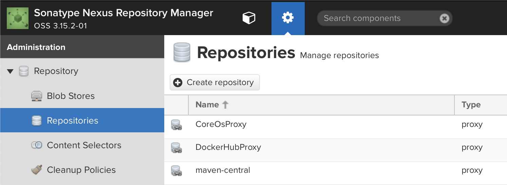

__Note:__ This is part of a series.  Make sure you started here: [Building a Portable Kubernetes Home Lab with OpenShift - OKD4](/home-lab/lab-intro/)

All of these devices will be running the OpenWRT linux distribution. Find out more here: [https://openwrt.org](https://openwrt.org)

__Note:__ If at any time you need to reset the router, or any of the below commands fail and need to be rerun, do this:

   Hold the highlighted button for about 10 seconds.  When you first press the button, the left most LED will start to slowly blink.  After about 3-4 seconds it will blink a bit faster.  After about 9-10 seconds it will blink really fast.  At this point, let go of the button.  Your router will factory reset itself.

   

### Configure the Edge Router

1. Connect to your edge router:

   __Note:__ The `GL-MV1000W` is not currently available, (06-2022), so you will either need to use a `GL-MV1000`, and set up your own lab wifi with a separate access point, or you can use the `GL-AR750S`.

   * Do not connect your router to any other network devices yet.
   * Power it on and connect to it from your workstation.
   * With the `GL-MV1000W` or `GL-AR750S` you can connect to the WiFi.  The initial SSID and passphrase are on the back of the router.
     Otherwise, connect from your workstation with a network cable.  I generally use a network cable to apply the initial configuration to all of my GL.iNet routers, wireless or not.
   * Ensure that you can ping the router: `ping 192.168.8.1`

1. Initialize the router configuration:

   You can use the GL.iNet `GL-MV1000W` or `GL-AR750S`  either as an access point, or as an access point plus repeater for wireless connection to your home network.

   I highly recommend using a cable to connect the router to your home network.  You will get much faster network speeds than you get in repeater mode.  But, the repeater mode is usable.  Especially when traveling.

   __To use the router with a wired connection to your home network, do this:__

   ```bash
   labcli --router -i -e -wl
   ```

   You will prompted to enter an `ESSID` and a passphrase for your new lab network.

   __To use the router in repeater mode, do this instead:__

   ```bash
   labcli --router -i -e -wl -ww
   ```

   You will prompted to enter the `ESSID`, `Channel`, and `Passphrase` for the wireless network you are bridging to, and you will prompted to enter an `ESSID` and a passphrase for your new lab network.

   __Note:__ The router will dump a list of the Wireless Networks that it sees.  You can get the channel from that list as well.

   When the configuration is complete, the router will reboot.

1. Finish configuring the router:

   Now, connect the router to your home network if you are not using the wireless-repeater mode.

   At this point you should be able to connect your workstation to your new lab WiFi network.

   Finish the configuration:

   ```bash
   labcli --router -s -e
   ```

   __Note:__   If you want to see the details of what labcli scripts are doing, I have a page with the manual instructions here: [Edge Network Router Configuration](/home-lab/edge-router/){:target="_blank"}

1. Wait for the router to reboot, and then reconnect to your new lab network.

1. Verify that DNS is working properly:

   ```bash
   ping google.com
   ```

### Configure the Internal Network Router

This configuration is very similar to setting up the edge router.

1. Connect to your internal network router:

   Do not connect your router to any other network devices yet.

   Power it on and connect to it from your workstation with a network cable.

   Ensure that you can ping the router: `ping 192.168.8.1`

1. Initialize the router configuration:

   ```bash
   labcli --router -i -d=dev
   ```

   When the configuration is complete, the router will reboot.

1. Finish the router configuration:

   Connect the internal router WAN port to one of the two LAN ports on the edge router.
  
   The WAN port is the left most port.

   Ensure that you can connect to the router:

   ```bash
   ping router.dev.my.awesome.lab
   ```

   Now, complete the router configuration:

   ```bash
   labcli --router -s -d=dev
   ```

   When the configuration is complete, the router will reboot.

   __Note:__  If you want to see the details of what labcli scripts are doing, I have a page with the manual instructions here: [Internal Network Router Configuration](/home-lab/internal-router/){:target="_blank"}

## Configure the Raspberry Pi

We are going to use the edge router that we set up previously to configure the OS for the Raspberry Pi.

__Note:__ If you are using the `GL-AR750S`, you will need a USB type A thumb drive with at least 2-GB capacity.  The thumb drive will be reformatted during this process, so don't use one with important files on it.

1. Insert the SD Card into the edge router.

1. If you are using the `GL-AR750S`, insert the thumb drive into the USB slot.

1. Install and configure OpenWRT on the SD Card:

   ```bash
   labcli --pi -i
   ```

   This will take a while to complete.

1. Remove the SD Card from the edge router and insert it into the Pi.

1. If you are using the `GL-AR750S`, remove the thumb drive from the USB slot.

1. Connect the network adapter from the Pi to the other LAN port on the edge router.

1. Power on the Pi.

1. Ensure that the Pi is on line:

   ```bash
   ping bastion.my.awesome.lab
   ```

1. Complete the configuration of the Pi:

   ```bash
   labcli --pi -s
   ```

   When the configuration is complete, the Pi will reboot.

### Install Developer Tools

1. Install Sonatype Nexus

   ```bash
   labcli --dev-tools -n
   ```

   __Note:__  If you want to see the details of what labcli scripts are doing, I have pages with the manual instructions here:

   [Install Sonatype Nexus on Raspberry Pi 4B with OpenWRT](/home-lab/nexus-pi/){:target="_blank"}

1. Start Nexus

   ```bash
   ssh root@bastion.${LAB_DOMAIN} "/etc/init.d/nexus start"
   ```

1. Nexus will take a while to start for the first time.

   Go make a nice cup of tea, coffee, or hot beverage of your choice.  Nexus will be up shortly.

1. After Nexus has started, trust the new Nexus cert on your workstation:

   ```bash
   labcli --trust -n
   ```

1. Install Gitea

   ```bash
   labcli --dev-tools -g
   ```

   __Note:__  If you want to see the details of what labcli scripts are doing, I have pages with the manual instructions here:

   [Installing Gitea on a Raspberry Pi 4B with OpenWRT](/home-lab/gitea-with-pi/){:target="_blank"}

1. Start Gitea

   ```bash
   ssh root@bastion.${LAB_DOMAIN} "/etc/init.d/gitea start"
   ```

1. Trust the gitea certs on your workstation:

   ```bash
   labcli --trust -g
   ```

   The Gitea web console will be at: `https://gitea.${LAB_DOMAIN}:3000`

   The script creates two users for Gitea:

   1. `gitea` - This is your Gitea admin user
   1. `devuser` - This is a non-privileged user for Gitea.

   Both passwords are initialized to `password`.  You will be prompted to change them when you log in.

## Set up Nexus for image mirroring:

1. Log into Nexus:

   Get the initial admin password for Nexus:

   ```bash
   echo $(ssh root@bastion.${LAB_DOMAIN} "cat /usr/local/nexus/sonatype-work/nexus3/admin.password")
   ```

   Now point your browser to `https://nexus.${LAB_DOMAIN}:8443`.  Login, and create a password for your admin user.

If prompted to allow anonymous access, select to allow.

The `?` in the top right hand corner of the Nexus screen will take you to their documentation.

1. We need to create a hosted Docker registry to hold the mirror of the OKD images that we will use to install our cluster.

   1. Login as your new admin user

   1. Select the gear icon from the top bar, in between a cube icon and the search dialog.

   1. Select `Repositories` from the left menu bar.

      

   1. Select `+ Create repository`

   1. Select `docker (hosted)`

      

   1. Name your repository `okd`

   1. Check `HTTPS` and put `5001` in the port dialog entry

   1. Check `Allow anonymous docker pull`

      

   1. Click `Create repository` at the bottom of the page.

1. Next we need to create a Proxy registry for `gcr.io`.  We'll need this later on for Tekton.

   1. Select `Repositories` from the left menu bar.

   1. Select `+ Create repository`

   1. Select `docker (proxy)`

   1. Name your repository `gcr-io`

   1. Check `Allow anonymous docker pull`

   1. Set `https://gcr.io` as the `Remote storage` location.

      

   1. Click `Create repository` at the bottom of the page.

1. Finally, create a Group registry as an umbrella for the hosted and proxy registries.

   1. Select `Repositories` from the left menu bar.

   1. Select `+ Create repository`

   1. Select `docker (group)`

   1. Name your repository `lab-registry`

   1. Check `HTTPS` and put `5000` in the port dialog entry

   1. Check `Allow anonymous docker pull`

      

   1. Add your other two registries as group members:

      

   1. Click `Create repository` at the bottom of the page.

1. Now expand the `Security` menu on the left and select `Realms`

   1. Add `Docker Bearer Token Realm` to the list of active `Realms`

      

   1. Click `Save`

1. Now, select `Roles` from the expanded `Security` menu on the left.

   1. Click `+ Create role` and select `Nexus role`

   1. Create the role as shown:

      

   1. Add the appropriate privileges as shown:

      

   1. Click `Create role`

1. Now, select `Users` from the expanded `Security` menu on the left.

    

   1. Click `Create local user`

   1. Create the user as shown:

      

We're now ready to start the installation of OpenShift.

* [Install KVM Based OpenShift](/home-lab/prepare-kvm-okd-install/)
* [Install Single Node OpenShift](/home-lab/prepare-bare-metal-sno-okd-install/)
* [Install Bare Metal OpenShift](/home-lab/prepare-bare-metal-okd-install/)
