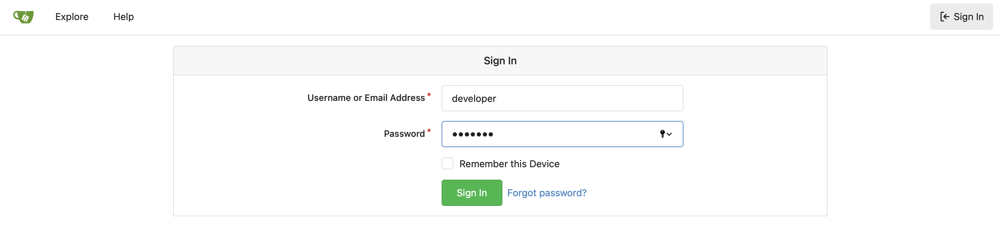
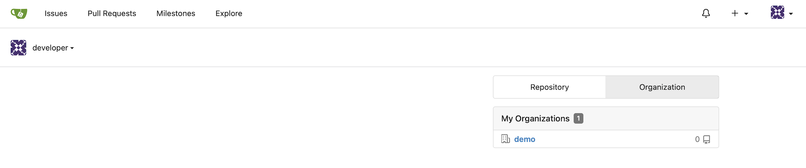
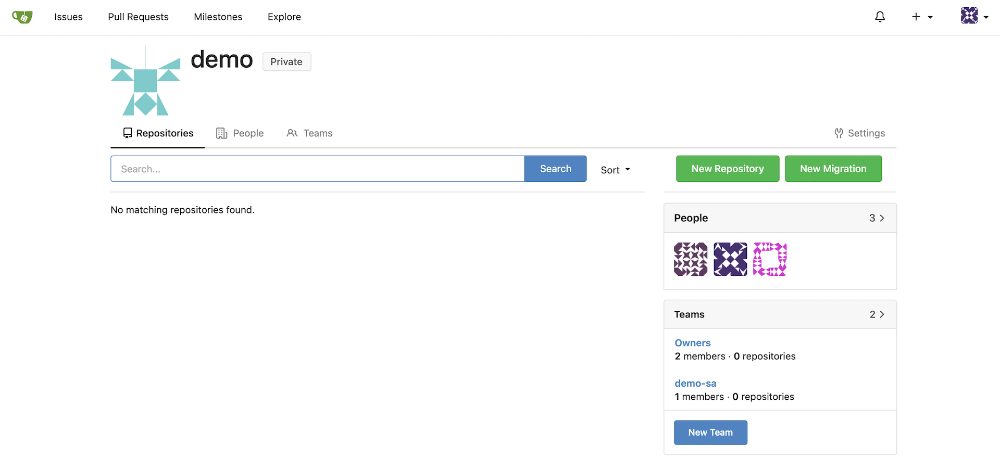
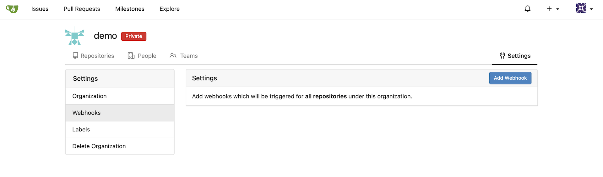
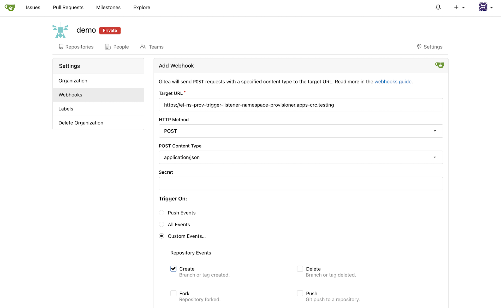
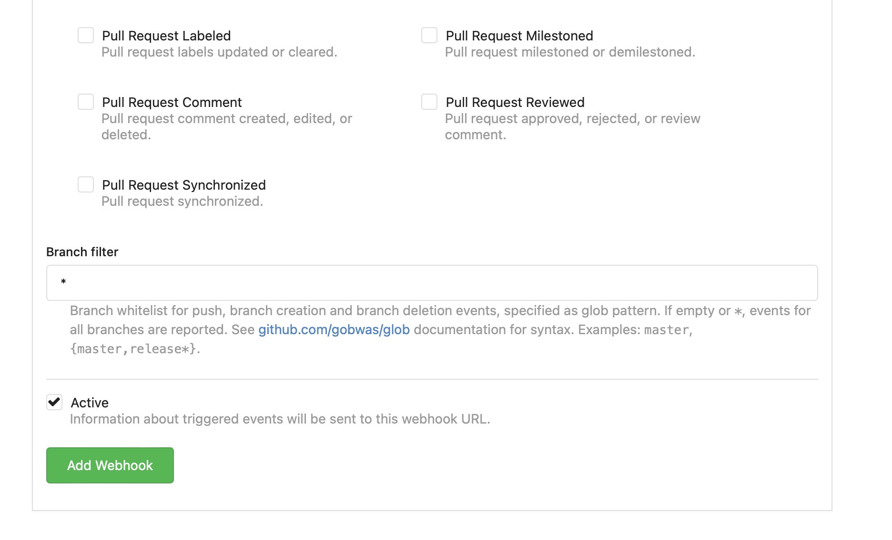
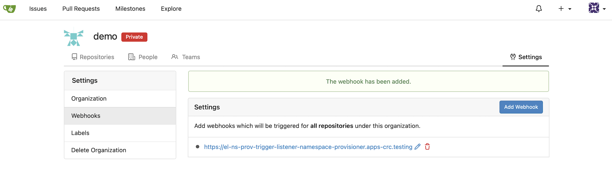
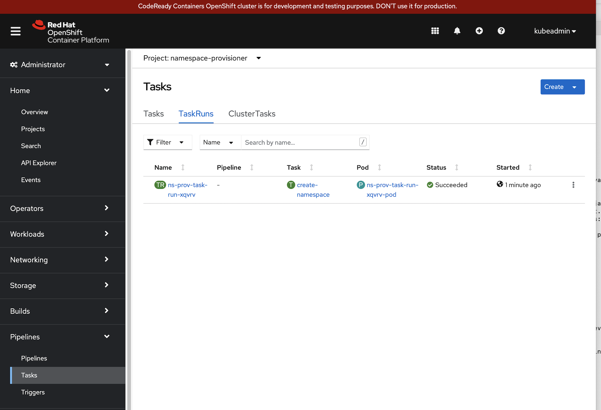

## Prerequisite

__[Triggers with a cup of Gitea - Cluster Setup](/tutorials/tekton-triggers-gitea-setup/){:target="_blank"}__

## Set Up The Namespace Provisioner

1. Create a Namespace

   ```bash
   oc new-project namespace-provisioner
   ```

1. Create a service account with self-provisioner privileges

   ```bash
   oc create sa provisioner -n namespace-provisioner
   oc adm policy add-cluster-role-to-user self-provisioner -z provisioner -n namespace-provisioner
   ```

1. Create a ConfigMap for the CA bundle that includes our Gitea server

   ```bash
   cat << EOF | oc apply -n namespace-provisioner -f -
   apiVersion: v1
   kind: ConfigMap
   metadata:
     name: trusted-ca
     labels:
       config.openshift.io/inject-trusted-cabundle: 'true'
   EOF
   ```

1. Create the Tekton Task and Trigger objects

   ```bash
   oc apply -f ~/tekton-tutorial/gitea-demo/namespace-provisioner/ -n namespace-provisioner
   ```

1. Expose the Trigger via a Secured Route

   ```bash
   SVC_NAME=$(oc get el ns-prov-trigger-listener -o=jsonpath='{.status.configuration.generatedName}')
   oc create route edge ${SVC_NAME} --service=${SVC_NAME}
   ```

## Create the Gitea Webhook

1. Retrieve the endpoint URL of the Trigger Event Listener

   ```bash
   echo "https://$(oc get route ${SVC_NAME} -o=jsonpath='{.spec.host}')"
   ```

1. Log into Gitea with the 'developer' user account:

   

1. Select the `Organization` tab on the right, and select the `demo` organization:

   

1. Click on `Settings` to the right above `New Migration`:

   

1. Select `Webhooks` from the menu on the left, and click `Add webhook`:

   

1. Use the URL from step 1 to fill in the webhook as shown:

   

1. Click the `Add Webhook` button:

   

1. Your webhook is ready to fire.

   

### Create A Git repository

Let's use the Quarkus CLI to create a Java application and add it to our Gitea repository:

1. Create a basic Quarkus REST service:

   We're using the Quarkus CLI for this step.  Check it out here: [https://quarkus.io/guides/cli-tooling](https://quarkus.io/guides/cli-tooling)

   ```bash
   mkdir ~/branch-test
   cd ~/branch-test

   quarkus create app --maven --java=11 --no-wrapper --package-name=fun.is.quarkus.demo fun.is.quarkus:hook-test:0.1
   ```

1. Initialize a git repository for the demo app code:

   ```bash
   cd ~/branch-test/hook-test
   git init -b main
   git add .
   git commit -m "initial commit"
   ```

1. Add the Gitea server as a remote origin:

   ```bash
   git remote add origin https://gitea-gitea.apps-crc.testing/demo/hook-test
   ```

1. Push the demo code to our Gitea instance:

   ```bash
   GIT_SSL_NO_VERIFY=true git push --set-upstream origin main
   ```

   __Note:__ We're using `GIT_SSL_NO_VERIFY` here because we have not set up trust between our Gitea server and workstation.

   When prompted, enter the credentials that you created for your gitea user: `developer`

## Take a Look at the Results

The webhook should have fired on the creation of the `main` branch.

1. Log into the OpenShift console as `kubeadmin`

   ```bash
   crc console --credentials
   crc console
   ```

1. Take a look at the `TaksRuns` in the `namespace-provisioner` namespace:

   

1. Log into the OpenShift CLI as the `developer` user:

   ```bash
   oc login -u developer -p developer https://api.crc.testing:6443
   ```

1. Take a look at the available namespaces:

   ```bash
   oc get projects
   ```

   ```bash
   NAME             DISPLAY NAME   STATUS
   hook-test-main                  Active
   ```

1. Create a new branch, and verify that another namespace appears:

   ```bash
   cd ~/branch-test/hook-test
   git checkout -b my-feature
   GIT_SSL_NO_VERIFY=true  git push --set-upstream origin my-feature
   ```

   ```bash
   oc get projects
   ```

   ```bash
   NAME                   DISPLAY NAME   STATUS
   hook-test-main                        Active
   hook-test-my-feature                  Active
   ```

### JSON Payload of a Create Hook

```json
{
  "sha": "9354b1ebd85dba28268d7a7fa2ba6722ef629542",
  "ref": "my-feature",
  "ref_type": "branch",
  "repository": {
    "id": 2,
    "owner": {
      "id": 4,
      "login": "demo",
      "full_name": "",
      "email": "",
      "avatar_url": "https://gitea-gitea.apps-crc.testing/avatars/fe01ce2a7fbac8fafaed7c982a04e229",
      "language": "",
      "is_admin": false,
      "last_login": "0001-01-01T00:00:00Z",
      "created": "2022-05-14T16:13:22Z",
      "restricted": false,
      "active": false,
      "prohibit_login": false,
      "location": "",
      "website": "",
      "description": "",
      "visibility": "private",
      "followers_count": 0,
      "following_count": 0,
      "starred_repos_count": 0,
      "username": "demo"
    },
    "name": "hook-test",
    "full_name": "demo/hook-test",
    "description": "",
    "empty": false,
    "private": true,
    "fork": false,
    "template": false,
    "parent": null,
    "mirror": false,
    "size": 215,
    "html_url": "https://gitea-gitea.apps-crc.testing/demo/hook-test",
    "ssh_url": "gitea@gitea-gitea.apps-crc.testing:demo/hook-test.git",
    "clone_url": "https://gitea-gitea.apps-crc.testing/demo/hook-test.git",
    "original_url": "",
    "website": "",
    "stars_count": 0,
    "forks_count": 0,
    "watchers_count": 3,
    "open_issues_count": 0,
    "open_pr_counter": 0,
    "release_counter": 0,
    "default_branch": "main",
    "archived": false,
    "created_at": "2022-05-15T13:07:04Z",
    "updated_at": "2022-05-15T13:17:47Z",
    "permissions": {
      "admin": false,
      "push": false,
      "pull": false
    },
    "has_issues": true,
    "internal_tracker": {
      "enable_time_tracker": true,
      "allow_only_contributors_to_track_time": true,
      "enable_issue_dependencies": true
    },
    "has_wiki": true,
    "has_pull_requests": true,
    "has_projects": true,
    "ignore_whitespace_conflicts": false,
    "allow_merge_commits": true,
    "allow_rebase": true,
    "allow_rebase_explicit": true,
    "allow_squash_merge": true,
    "default_merge_style": "merge",
    "avatar_url": "",
    "internal": false,
    "mirror_interval": "",
    "mirror_updated": "0001-01-01T00:00:00Z",
    "repo_transfer": null
  },
  "sender": {
    "id": 2,
    "login": "developer",
    "full_name": "",
    "email": "developer@gitea.crc.testing",
    "avatar_url": "https://secure.gravatar.com/avatar/b2f888cb41ee3b9f75d5844732d68765?d=identicon",
    "language": "",
    "is_admin": false,
    "last_login": "0001-01-01T00:00:00Z",
    "created": "2022-05-14T15:48:18Z",
    "restricted": false,
    "active": false,
    "prohibit_login": false,
    "location": "",
    "website": "",
    "description": "",
    "visibility": "public",
    "followers_count": 0,
    "following_count": 0,
    "starred_repos_count": 0,
    "username": "developer"
  }
}
```