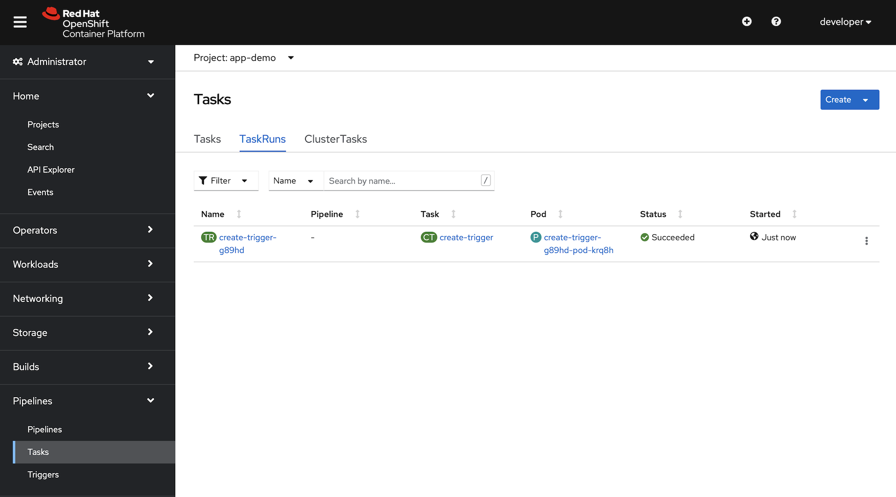
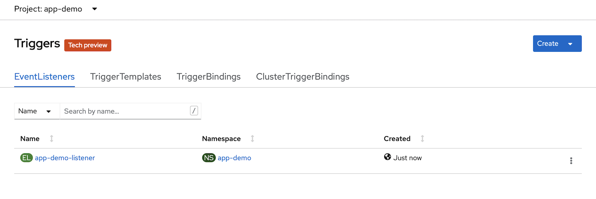
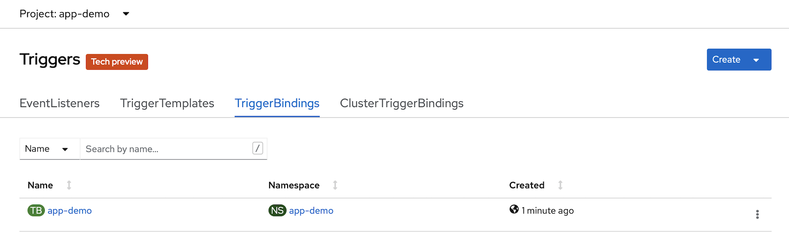
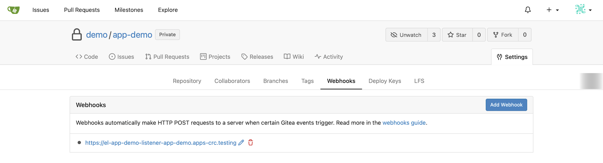
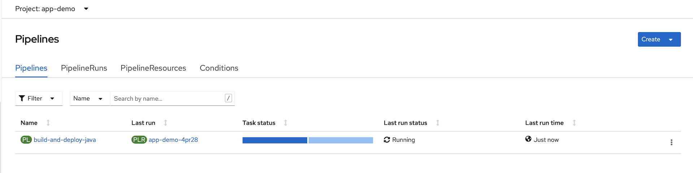

### Set Up an OpenShift Project for the Quarkus Application

1. Login to the CLI of your CRC OpenShift cluster as your `dev` user:

   ```bash
   oc login -u developer -p developer https://api.crc.testing:6443
   ```

1. Create a project for our Quarkus demo app:

   ```bash
   oc new-project app-demo
   ```

1. Set up the namespace scoped resources that we need:

   ```bash
   oc process openshift//namespace-java-tekton-resources | oc apply -n app-demo -f -
   ```

   This Template creates two objects for us:

   1. A Pipeline that we will use for the build and deploy of our application.

   1. A ConfigMap that gets automatically populated with the trusted certs in this cluster.  These certs are used by the ClusterTasks that we added in the previous step to establish trust with Gitea and the Gitea Interceptor.

1. Create an authentication secret so that the pipeline service account can access gitea with the credentials we created above:

   Place the credentials into environment variables.  We're using the `read` shell command so that the username and password are not stored in the shell history.

   ```bash
   read GITEA_USER
   ```

   Type the service account user name that we created, `demo-sa` above and hit `return`:

   ```bash
   read -s GITEA_PASSWD
   ```

   Type the service account password that we created above and hit `return`:

1. Now create a Kubernetes Secret with this information:

   ```bash
   cat << EOF | oc apply -n app-demo -f -
   apiVersion: v1
   kind: Secret
   metadata:
       name: gitea-secret
       annotations:
         tekton.dev/git-0: https://$(oc get route gitea -o=jsonpath='{.spec.host}' -n gitea)
   type: kubernetes.io/basic-auth
   data:
     username: $(echo -n ${GITEA_USER} | base64)
     password: $(echo -n ${GITEA_PASSWD} | base64)
   EOF
   ```

1. Patch the `pipeline` service account to allow it to use the Secret that we just created for git credentials.

   ```bash
   oc patch sa pipeline --type json --patch '[{"op": "add", "path": "/secrets/-", "value": {"name":"gitea-secret"}}]' -n app-demo
   ```

1. Clear the environment variables:

   ```bash
   GITEA_USER=""
   GITEA_PASSWD=""
   ```

### Create A Quarkus Application

1. Create a basic Quarkus REST service:

   We're using the Quarkus CLI for this step.  Check it out here: [https://quarkus.io/guides/cli-tooling](https://quarkus.io/guides/cli-tooling)

   ```bash
   quarkus create app --maven --java=11 --no-wrapper --package-name=fun.is.quarkus.demo fun.is.quarkus:app-demo:0.1
   ```

1. Initialize a git repository for the demo app code:

   ```bash
   cd app-demo
   git init -b main
   git add .
   git commit -m "initial commit"
   ```

1. Add the Gitea server as a remote origin:

   ```bash
   git remote add origin https://$(oc get route gitea -o=jsonpath='{.spec.host}' -n gitea)/demo/app-demo
   ```

1. Push the demo code to our Gitea instance:

   ```bash
   git push --set-upstream origin main
   ```

   When prompted, enter the credentials that you created for your gitea `devuser`

1. Create the Tekton resources for your new application:

   ```bash
   oc process openshift//create-rolling-replace-quarkus-fast-jar-app -p GIT_REPOSITORY=https://$(oc get route gitea -o=jsonpath='{.spec.host}' -n gitea)/demo/app-demo -p GIT_BRANCH=main | oc create -n app-demo -f -
   ```

### Pause And Look At What Was Deployed:

The `create-rolling-replace-quarkus-fast-jar-app` Template created a TaskRun of the ClusterTask `create-trigger` that was installed as part of the manifests you installed. 

The TaskRun used the parameters that we passed in and created several resources for you:

1. It processed another Template, `gitea-tekton-trigger` which creates the Tekton Trigger resources for you.

   Look at the `app-demo` project in the OpenSift console.  In the `Pipelines` section, explore `Tasks` and `Triggers`.

   You will see that we have a completed TaskRun, and we have an instance of `TriggerTemplate`, `TriggerBinding` and `EventListener`.

   

   

   

   

1. It created a `Route` for the `EventListener`

1. It created a `Secret` for the Gitea Webhook, and patched the `pipeline` service account to use that secret.

1. It created a WebHook in our project in the Gitea server.

   Log into Gitea, and take a look at the webhook that was created.

   

At this point, we have: 

* A Git repo with code in it
* An OpenShift project ready to receive a running application
* A gitea webhook configured to monitor for `push` events
* A Tekton eventListener wired up to receive the webhook

We've got all of the basic elements of CI/CD...   So, let's run it!  Then we'll talk about it.

### Run The Demo

1. Open the browser console to your OpenShift cluster:

   ```bash
   crc console
   ```

   Login in as the `developer` user

1. Navigate to the `Pipelines` resources of your `app-demo` project:

1. Watch the `build-and-deploy-java` Pipeline in the console window while you execute the next step.

1. Make a code change to the project:

   ```bash
   echo "test-1" >> test.txt
   git add .
   git commit -m "test-1"
   git push
   ```

1. Watch the pipeline that was just triggered!

   

1. The pipeline run is complete when the progress bar is solid green.

   Go explore your new Deployment for a bit.

1. Now, let's make another code change, and trigger another run.

   ```bash
   echo "test-2" >> test.txt
   git commit -a -m "test-2"
   git push
   ```

1. Watch the new pipeline run that was just triggered!

   

1. When that run completes, take a look at the Deployments in your project.

   You will see that there are now 2 deployments.  One that is labeled `latest`, and one that is labeled `previous`.

   We'll dig into that when we take about all of the elements in this demo.

### Add Health Probes to The Quarkus Demo Application

1. Add the SmallRye Health dependency to our demo code:

   ```bash
   quarkus ext add quarkus-smallrye-health
   ```

1. Add a custom patch for the conventional Deployment that the pipeline creates:

   ```bash
   mkdir -p deploy-config/patch

   cat << EOF > deploy-config/patch/deployment-patch.yaml
   spec:
     replicas: 2
     template:
       spec:
         containers:
         - name: --DEPLOY_NAME--
           resources:
             requests:
               memory: 32Mi
               cpu:    50m
             limits:
               memory: 128Mi
               cpu:    100m
           readinessProbe:
             failureThreshold: 10
             httpGet:
               path: /q/health/ready
               port: 8080
               scheme: HTTP
             periodSeconds: 5
             successThreshold: 1
             timeoutSeconds: 5
           livenessProbe:
             failureThreshold: 10
             httpGet:
               path: /q/health/live
               port: 8080
               scheme: HTTP
             periodSeconds: 5
             successThreshold: 1
             timeoutSeconds: 5
         terminationGracePeriodSeconds: 15
   EOF
   ```

1. Commit and push these changes to trigger another pipeline run:

   ```bash
   git add .
   git commit -m health
   git push
   ```
