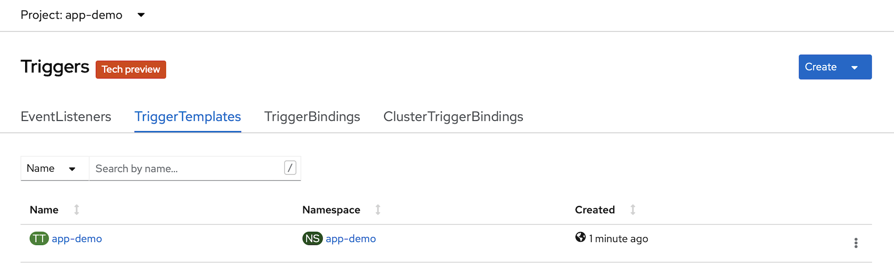

### Set Up an OpenShift Project for the Quarkus Application

1. Login to the CLI of your CRC OpenShift cluster as your `dev` user:

   ```bash
   oc login -u developer -p developer https://api.crc.testing:6443
   ```

1. Create a project for our Quarkus demo app:

   ```bash
   oc new-project app-demo
   ```

1. Set up the namespace scoped resources that we need:

   ```bash
   oc process openshift//namespace-java-tekton-resources | oc apply -n app-demo -f -
   ```

   This Template creates two objects for us:

   1. A Pipeline that we will use for the build and deploy of our application.

   1. A ConfigMap that gets automatically populated with the trusted certs in this cluster.  These certs are used by the ClusterTasks that we added in the previous step to establish trust with Gitea and the Gitea Interceptor.

1. Create an authentication secret so that the pipeline service account can access gitea with the credentials we created above:

   Place the credentials into environment variables.  We're using the `read` shell command so that the username and password are not stored in the shell history.

   ```bash
   read GITEA_USER
   ```

   Type the service account user name that we created, `demo-sa` above and hit `return`:

   ```bash
   read -s GITEA_PASSWD
   ```

   Type the service account password that we created above and hit `return`:

1. Now create a Kubernetes Secret with this information:

   ```bash
   cat << EOF | oc apply -n app-demo -f -
   apiVersion: v1
   kind: Secret
   metadata:
       name: gitea-secret
       annotations:
         tekton.dev/git-0: https://$(oc get route gitea -o=jsonpath='{.spec.host}' -n gitea)
   type: kubernetes.io/basic-auth
   data:
     username: $(echo -n ${GITEA_USER} | base64)
     password: $(echo -n ${GITEA_PASSWD} | base64)
   EOF
   ```

1. Patch the `pipeline` service account to allow it to use the Secret that we just created for git credentials.

   ```bash
   oc patch sa pipeline --type json --patch '[{"op": "add", "path": "/secrets/-", "value": {"name":"gitea-secret"}}]' -n app-demo
   ```

1. Clear the environment variables:

   ```bash
   GITEA_USER=""
   GITEA_PASSWD=""
   ```

### Create A Quarkus Application

1. Create a basic Quarkus REST service:

   We're using the Quarkus CLI for this step.  Check it out here: [https://quarkus.io/guides/cli-tooling](https://quarkus.io/guides/cli-tooling)

   ```bash
   quarkus create app --maven --java=11 --no-wrapper --package-name=fun.is.quarkus.demo fun.is.quarkus:app-demo:0.1
   ```

1. Initialize a git repository for the demo app code:

   ```bash
   cd app-demo
   git init -b main
   git add .
   git commit -m "initial commit"
   ```

1. Add the Gitea server as a remote origin:

   ```bash
   git remote add origin https://$(oc get route gitea -o=jsonpath='{.spec.host}' -n gitea)/demo/app-demo
   ```

1. Push the demo code to our Gitea instance:

   ```bash
   git push --set-upstream origin main
   ```

   When prompted, enter the credentials that you created for your gitea `devuser`

1. Create the Tekton resources for your new application:

   ```bash
   oc process openshift//create-rolling-replace-quarkus-fast-jar-app -p GIT_REPOSITORY=https://$(oc get route gitea -o=jsonpath='{.spec.host}' -n gitea)/demo/app-demo -p GIT_BRANCH=main | oc create -n app-demo -f -
   ```

### Pause And Look At What Was Deployed

The `create-rolling-replace-quarkus-fast-jar-app` Template created a TaskRun of the ClusterTask `create-trigger` that was installed as part of the manifests you installed.

The TaskRun used the parameters that we passed in and created several resources for you:

1. It processed another Template, `gitea-tekton-trigger` which creates the Tekton Trigger resources for you.

   Look at the `app-demo` project in the OpenSift console.  In the `Pipelines` section, explore `Tasks` and `Triggers`.

   You will see that we have a completed TaskRun, and we have an instance of `TriggerTemplate`, `TriggerBinding` and `EventListener`.

   

   

   

   

1. It created a `Route` for the `EventListener`

1. It created a `Secret` for the Gitea Webhook, and patched the `pipeline` service account to use that secret.

1. It created a WebHook in our project in the Gitea server.

   Log into Gitea, and take a look at the webhook that was created.

   

At this point, we have:

* A Git repo with code in it
* An OpenShift project ready to receive a running application
* A gitea webhook configured to monitor for `push` events
* A Tekton eventListener wired up to receive the webhook

We've got all of the basic elements of CI/CD...   So, let's run it!  Then we'll talk about it.

### Run The Demo

1. Open the browser console to your OpenShift cluster:

   ```bash
   crc console
   ```

   Login in as the `developer` user

1. Navigate to the `Pipelines` resources of your `app-demo` project:

1. Watch the `build-and-deploy-java` Pipeline in the console window while you execute the next step.

1. Make a code change to the project:

   ```bash
   echo "test-1" >> test.txt
   git add .
   git commit -m "test-1"
   git push
   ```

1. Watch the pipeline that was just triggered!

   

1. The pipeline run is complete when the progress bar is solid green.

   Go explore your new Deployment for a bit.

1. Now, let's make another code change, and trigger another run.

   ```bash
   echo "test-2" >> test.txt
   git commit -a -m "test-2"
   git push
   ```

1. Watch the new pipeline run that was just triggered!

   

1. When that run completes, take a look at the Deployments in your project.

   You will see that there are now 2 deployments.  One that is labeled `latest`, and one that is labeled `previous`.

   We'll dig into that when we take about all of the elements in this demo.

### Add Health Probes to The Quarkus Demo Application

1. Add the SmallRye Health dependency to our demo code:

   ```bash
   quarkus ext add quarkus-smallrye-health
   ```

1. Add a custom patch for the conventional Deployment that the pipeline creates:

   ```bash
   mkdir -p deploy-config/patch

   cat << EOF > deploy-config/patch/deployment-patch.yaml
   spec:
     replicas: 2
     template:
       spec:
         containers:
         - name: --DEPLOY_NAME--
           resources:
             requests:
               memory: 32Mi
               cpu:    50m
             limits:
               memory: 128Mi
               cpu:    100m
           readinessProbe:
             failureThreshold: 10
             httpGet:
               path: /q/health/ready
               port: 8080
               scheme: HTTP
             periodSeconds: 5
             successThreshold: 1
             timeoutSeconds: 5
           livenessProbe:
             failureThreshold: 10
             httpGet:
               path: /q/health/live
               port: 8080
               scheme: HTTP
             periodSeconds: 5
             successThreshold: 1
             timeoutSeconds: 5
         terminationGracePeriodSeconds: 15
   EOF
   ```

1. Commit and push these changes to trigger another pipeline run:

   ```bash
   git add .
   git commit -m health
   git push
   ```

1. Explore the new Deployment.

   Note that there are now 2 replicas, and that the health and liveness probes are pointing to the SmallRye Health endpoints.

## Explore All The Pieces and Parts

OK.  That demo did a lot, with a lot of moving parts.

Let's take a look at what it did:

1. We invoked an Openshift Template to set up our new project with a Tekton Pipeline, and a ConfigMap for trusted certs.

1. We invoked an OpenShift Template to kick set up a Gitea webhook for our code, and create Tekton trigger resources to respond to the webhook.

1. We triggered the webhook by pushing code changes to our Gitea repo.

Here's the key points of this demo:

1. The developer did not have to create any Tekton resources.  They are all provided in a cluster scoped way via Templates, and ClusterTasks.

1. The CI/CD pipeline takes a Convention Over Code approach.

   * It assumes that all Java Quarkus applications are pretty much built and deployed in much the same way.
   * It allows for customization via yaml patches which are applied to the conventionally created Deployment in order to adjust elements that are application specific
     * Pod Replicas
     * Health Probes
     * Resource Requests & Limits
     * Etc...

1. The pipeline implements a Canary style deployment, in that it waits for the new Deployment to reach full scale and pass it's readiness probes before scaling down the previous deployment.

1. It retains the previous deployment for roll back.

1. It implements a Service with can load balance across both deployments.

   Because of this, the previous deployment can be scaled up to create a Blue/Green scenario.

   Modification of the CI/CD resources could make this a parameter driven possibility.

1. There is traceability implemented to allow you to see exactly which code a given deployment is running:

   * Every resource of the Deployment includes the short hash of the git commit in its name
   * The Git commit SHA is applied to the resulting container image as a label
   * The git clone URL of the code is included as a label on the container image

### Explore the Code

Below are all of the resources, in the order that they are used:

I'm not going to dissect all of these for you.  At this point we have covered all of the basics of Tekton, and even some more advanced items.

This demo is intended to give you a taste of the realm of the possible.  Take these code samples with a grain of salt.  They are my own opinionated way to demo the strengths of Tekton.

Now, take this code and make it your own!

__Happy Coding!__

1. The Template that is invoked to create the Pipeline and TLS cert ConfigMap:

   ```yaml
   apiVersion: template.openshift.io/v1
   kind: Template
   metadata:
     annotations:
       template.openshift.io/bindable: "false"
     name: namespace-java-tekton-resources
     namespace: openshift
   objects:
   - apiVersion: tekton.dev/v1beta1
     kind: Pipeline
     metadata:
       name: build-and-deploy-java
     spec:
       params:
       - name: app-name
         type: string
         description: The application name
       - name: build-type
         type: string
         description: "Selected build type: quarkus-jvm, quarkus-fast-jar, quarkus-native, spring-boot"
       - name: deploy-type
         type: string
         description: "Selected deploy type: rolling-replace, blue-green, simple"
       - name: git-repo-url
         type: string
         description: "Git Repository URL"
       - name: git-checkout
         type: string
         description: "Git code to checkout, either a branch name or a commit sha.  Determined by the value of clone-type"
         default: "main"
       - name: clone-type
         type: string
         description: "The type of git clone: sha, branch"
         default: "branch"
       - name: config-git-path
         type: string
         description: "Config Git Path"
         default: "/deploy-config"
       tasks:
       - name: build
         taskRef:
           name: build-java
           kind: ClusterTask
         params:
         - name: app-name
           value: $(params.app-name)
         - name: build-type
           value: $(params.build-type)
         - name: git-repo-url
           value: $(params.git-repo-url)
         - name: git-checkout
           value: $(params.git-checkout)
         - name: clone-type
           value: $(params.clone-type)
       - name: deploy-rolling-replace
         taskRef:
           name: deploy-rolling-replace
           kind: ClusterTask
         runAfter:
         - build
         when:
         - input: "$(params.deploy-type)"
           operator: in
           values: ["rolling-replace"]
         params:
         - name: app-name
           value: $(params.app-name)
         - name: git-repo-url
           value: $(params.git-repo-url)
         - name: git-checkout
           value: $(params.git-checkout)
         - name: clone-type
           value: $(params.clone-type)
         - name: config-git-path
           value: $(params.config-git-path)
   - apiVersion: v1
     kind: ConfigMap
     metadata:
       name: trusted-ca
       labels:
         config.openshift.io/inject-trusted-cabundle: 'true'
   ```

1. The Template that is invoked to set up the Trigger and Webhook resources:

   ```yaml
   apiVersion: template.openshift.io/v1
   kind: Template
   metadata:
     annotations:
       description: "Build and Deploy template for Quarkus applications built using a Tekton Pipeline."
       iconClass: icon-openjdk
       openshift.io/display-name: "Quarkus Fast-Jar Build & Deploy Pipeline for DEV - GitLab Webhook"
       template.openshift.io/bindable: "false"
       tags: "java,quarkus"
       version: "1.0"
     name: create-rolling-replace-quarkus-fast-jar-app
     namespace: openshift
   objects:
     - apiVersion: tekton.dev/v1beta1
       kind: TaskRun
       metadata:
         generateName: create-trigger-
       spec:
         taskRef:
           name: create-trigger
           kind: ClusterTask
         params:
         - name: git-repo-url
           value: ${GIT_REPOSITORY}
         - name: git-branch
           value: ${GIT_BRANCH}
         - name: build-type
           value: quarkus-fast-jar
         - name: deploy-type
           value: rolling-replace
   parameters:
   - 
     description: "Git repository for source code"
     displayName: "Git Repo"
     name: GIT_REPOSITORY
     required: true
   -
     description: "Git repository branch to build app from"
     displayName: "Git Branch"
     name: GIT_BRANCH
     required: true
     value: "main"
   ```

1. The Task that is invoked by the Template above:

   ```yaml
   apiVersion: tekton.dev/v1beta1
   kind: ClusterTask
   metadata:
     name: create-trigger
   spec:
     stepTemplate:
       volumeMounts:
       - name: trusted-ca
         mountPath: /etc/pki/ca-trust/extracted/pem
         readOnly: true
     params:
     - name: git-repo-url
       type: string
       description: "Git Repository URL"
     - name: git-branch
       type: string
       description: "Git Branch to monitor"
       default: "main"
     - name: build-type
       type: string
       description: "Selected build type: quarkus-jvm, quarkus-fast-jar, quarkus-native, spring-boot"
       default: "quarkus-fast-jar"
     - name: deploy-type
       type: string
       description: "Pipeline to run: rolling-replace, blue-green, simple"
       default: "rolling-replace"
     volumes:
     - name: trusted-ca
       configMap:
         name: trusted-ca
         items:
           - key: ca-bundle.crt 
             path: tls-ca-bundle.pem
     steps:
     - name: create-trigger-objects
       image: image-registry.openshift-image-registry.svc:5000/openshift/cli:latest
       imagePullPolicy: IfNotPresent
       workingDir: /workspace
       script: |
         #!/bin/bash
         echo -----------------------------------
         echo "Creating Application Resources"
         APP_NAME=$(basename $(params.git-repo-url) | cut -d'.' -f1 | tr "[:upper:]" "[:lower:]")
         oc process openshift//gitea-tekton-trigger -p APP_NAME=${APP_NAME} -p GIT_REPOSITORY=$(params.git-repo-url) -p GIT_BRANCH=$(params.git-branch) -p BUILD_TYPE=$(params.build-type) -p DEPLOY_TYPE=$(params.deploy-type) | oc apply -f -
         echo -----------------------------------
         echo "Creating Route for Event Listener"
         SVC_NAME=$(oc get el ${APP_NAME}-listener -o=jsonpath='{.status.configuration.generatedName}')
         oc create route edge ${SVC_NAME} --service=${SVC_NAME}
         HOOK_URL="https://$(oc get route ${SVC_NAME} -o=jsonpath='{.spec.host}')"
         SECRET=$(echo $RANDOM | md5sum | cut -d" " -f1)
         oc create secret generic ${APP_NAME}-githook-secret --from-literal=GIT_HOOK_SECRET=${SECRET}
         oc patch sa pipeline --type json --patch "[{\"op\": \"add\", \"path\": \"/secrets/-\", \"value\": {\"name\":\"${APP_NAME}-githook-secret\"}}]" -n app-demo
         echo "export APP_NAME=${APP_NAME}" >> /workspace/env-vars
         echo "export HOOK_URL=${HOOK_URL}" >> /workspace/env-vars
         echo "export SECRET=${SECRET}" >> /workspace/env-vars
         echo -----------------------------------
     - name: create-webhook
       image: quay.io/cgruver0/java-11-builder:latest
       imagePullPolicy: IfNotPresent
       env:
       - name: user.home
         value: /tekton/home
       workingDir: "/workspace"
       script: |
         #!/bin/bash
         echo -----------------------------------
         echo "Creating Webhook"
         . /workspace/env-vars

         PROJECT_PATH=$(echo $(params.git-repo-url) | cut -d"/" -f4- | cut -d"." -f1)
         GIT_URL=$(echo $(params.git-repo-url) | cut -d"/" -f-3) 
         GIT_CREDS="$(cat /tekton/creds-secrets/gitea-secret/username):$(cat /tekton/creds-secrets/gitea-secret/password)"
         API_PATH="/api/v1/repos/${PROJECT_PATH}/hooks"
         API_URL="${GIT_URL}${API_PATH}"
         curl --location --request POST ${API_URL} -u ${GIT_CREDS} --header 'Content-Type: application/json' --data-raw "{\"active\":true,\"branch_filter\":\"$(params.git-branch)\",\"config\":{\"content_type\":\"json\",\"url\":\"${HOOK_URL}\",\"http_method\": \"post\",\"secret\":\"${SECRET}\"},\"events\": [\"push\"],\"type\": \"gitea\"}"
         echo -----------------------------------
   ```

1. The Template that is invoked by the Task above:

   ```yaml
   apiVersion: template.openshift.io/v1
   kind: Template
   metadata:
     annotations:
       template.openshift.io/bindable: "false"
     name: gitea-tekton-trigger
     namespace: openshift
   objects:
     - apiVersion: triggers.tekton.dev/v1beta1
       kind: TriggerTemplate
       metadata:
         name: ${APP_NAME}
         annotations:
           triggers.tekton.dev/old-escape-quotes: 'true'
       spec:
         params:
           - name: git-checkout-sha
             description: The git SHA to checkout
             default: main
           - name: git-repo-url
             description: The git repository url
           - name: git-signature
             description: The SHA256 signature of the payload
           - name: git-event
             description: The git event that caused the webhook to fire
           - name: trigger-payload
             description: The trigger payload
         resourcetemplates:
           - apiVersion: tekton.dev/v1beta1
             kind: PipelineRun
             metadata:
               generateName: ${APP_NAME}-
               labels:
                 app-name: ${APP_NAME}
             spec:
               serviceAccountName: pipeline
               pipelineRef: 
                 name: build-and-deploy-java
               params:
               - name: app-name
                 value: ${APP_NAME}
               - name: build-type
                 value: ${BUILD_TYPE}
               - name: deploy-type
                 value: ${DEPLOY_TYPE}
               - name: git-repo-url
                 value: $(tt.params.git-repo-url)
               - name: git-checkout
                 value: $(tt.params.git-checkout-sha)
               - name: clone-type
                 value: "sha"
               - name: config-git-path
                 value: "${CONFIG_PATH}"
     - apiVersion: triggers.tekton.dev/v1beta1
       kind: EventListener
       metadata:
         name: ${APP_NAME}-listener
       spec:
         serviceAccountName: pipeline
         triggers:
           - name: ${APP_NAME}-trigger
             interceptors:
               - ref:
                   apiVersion: triggers.tekton.dev
                   kind: ClusterInterceptor
                   name: "gitea"
                 params:
                 - name: "secretRef"
                   value:
                     secretName: ${APP_NAME}-githook-secret
                     secretKey: GIT_HOOK_SECRET
                 - name: "validEvents"
                   value: ["push"]
             bindings:
             - ref: ${APP_NAME}
             template:
               ref: ${APP_NAME}
     - apiVersion: triggers.tekton.dev/v1beta1
       kind: TriggerBinding
       metadata:
         name: ${APP_NAME}
       spec:
         params:
           - name: git-checkout-sha
             value: "$(body.after)"
           - name: git-repo-url
             value: ${GIT_REPOSITORY}.git
   parameters:
     -
       name: APP_NAME
       required: true
     -
       name: GIT_REPOSITORY
       required: true
     -
       name: GIT_BRANCH
       required: true
       value: "main"
     - 
       name: BUILD_TYPE
       required: true
     -
       name: DEPLOY_TYPE
       required: true
       value: "rolling-replace"
     - 
       name: CONFIG_PATH
       required: true
       value: "/deploy-config"
   ```

1. The first Task invoked in the triggered PipelineRun which builds the application code and creates the container image:

   ```yaml
   apiVersion: tekton.dev/v1beta1
   kind: ClusterTask
   metadata:
     name: build-java
   spec:
     stepTemplate:
       volumeMounts:
       - name: varlibc
         mountPath: /var/lib/containers
       - name: trusted-ca
         mountPath: /etc/pki/ca-trust/extracted/pem
         readOnly: true
     params:
     - name: app-name
       type: string
       description: The application name
     - name: build-type
       type: string
       description: "Selected build type: quarkus-jvm, quarkus-fast-jar, quarkus-native, spring-boot"
     - name: git-repo-url
       type: string
       description: "Git Repository URL"
     - name: git-checkout
       type: string
       description: "Git code to checkout, either a branch name or a commit sha.  Determined by the value of clone-type"
     - name: clone-type
       type: string
       description: "The type of git clone: sha, branch"
       default: "branch"
     volumes:
     - name: varlibc
       emptyDir: {}
     - name: trusted-ca
       configMap:
         name: trusted-ca
         items:
           - key: ca-bundle.crt 
             path: tls-ca-bundle.pem
     steps:
     - name: prep-build
       image: quay.io/cgruver0/java-11-builder:latest
       imagePullPolicy: IfNotPresent
       script: |
         #!/bin/bash
         mkdir -p /workspace/source
         chmod 777 /workspace/source
         case $(params.clone-type) in
           sha)
             cd /workspace/source
             git init
             git remote add origin $(params.git-repo-url)
             git pull origin $(params.git-checkout)
             echo "$(params.git-checkout)" > /workspace/git-sha.out
           ;;
           branch)
             git clone -b $(params.git-checkout) --single-branch $(params.git-repo-url) /workspace/source
             cd /workspace/source
             echo "$(git rev-parse HEAD)" > /workspace/git-sha.out
           ;;
         esac
       env:
       - name: user.home
         value: /tekton/home
       workingDir: "/"
     - name: build-sources
       image: quay.io/cgruver0/java-11-builder:latest
       imagePullPolicy: IfNotPresent
       script: |
         #!/bin/bash
         MVN_ARGS="-DskipTests -DappName=app"
         case $(params.build-type) in
           spring-boot)
           ;;
           quarkus-jvm)
           ;;
           quarkus-fast-jar)
           MVN_ARGS="${MVN_ARGS} -Dquarkus.package.type=fast-jar"
           ;;
           quarkus-native)
           MVN_ARGS="${MVN_ARGS} -Pnative"
           ;;
         esac
         mvn ${MVN_ARGS} clean package
       env:
       - name: user.home
         value: /tekton/home
       workingDir: "/workspace/source"
     - name: prep-workingdir-for-buildah
       image: quay.io/buildah/stable:latest
       imagePullPolicy: IfNotPresent
       script: |
         chmod 777 /workspace/source
         chown -R 1000 /tekton/home
       env:
       - name: user.home
         value: /tekton/home
       workingDir: "/workspace/source"
     - name: build-image
       image: quay.io/buildah/stable:latest
       securityContext:
         runAsUser: 1000
       imagePullPolicy: IfNotPresent
       script: |
         #!/bin/bash
         SHA=$(cat /workspace/git-sha.out)
         BUILDAH_ARGS="--storage-driver vfs"
         export BUILDAH_ISOLATION=chroot
         DESTINATION_IMAGE="image-registry.openshift-image-registry.svc:5000/$(context.taskRun.namespace)/$(params.app-name)"
         if [[ $(params.build-type) == "quarkus-native" ]]
         then
           CONTAINER=$(buildah ${BUILDAH_ARGS} from registry.access.redhat.com/ubi8/ubi-minimal:8.5)
         else
           CONTAINER=$(buildah ${BUILDAH_ARGS} from quay.io/cgruver0/java-11-app-runner:latest )
         fi
         case $(params.build-type) in
           spring-boot)
           buildah ${BUILDAH_ARGS} copy ${CONTAINER} ./target/app.jar /deployments/app.jar
           ;;
           quarkus-jvm)
           buildah ${BUILDAH_ARGS} copy ${CONTAINER} ./target/lib/* /deployments/lib/
           buildah ${BUILDAH_ARGS} copy ${CONTAINER} ./target/app-runner.jar /deployments/app.jar
           ;;
           quarkus-fast-jar)
           buildah ${BUILDAH_ARGS} copy ${CONTAINER} ./target/quarkus-app/lib/ /deployments/lib/
           buildah ${BUILDAH_ARGS} copy ${CONTAINER} ./target/quarkus-app/quarkus-run.jar /deployments/app.jar
           buildah ${BUILDAH_ARGS} copy ${CONTAINER} ./target/quarkus-app/app/ /deployments/app/
           buildah ${BUILDAH_ARGS} copy ${CONTAINER} ./target/quarkus-app/quarkus/ /deployments/quarkus/
           ;;
           quarkus-native)
           buildah ${BUILDAH_ARGS} copy ${CONTAINER} ./target/app-runner /application
           buildah ${BUILDAH_ARGS} config --entrypoint '["/application", "-Dquarkus.http.host=0.0.0.0", "${JAVA_OPTIONS}"]' --port 8080 ${CONTAINER}
         esac
         buildah ${BUILDAH_ARGS} config --label GIT_COMMIT=${SHA} --author="Tekton" ${CONTAINER}
         buildah ${BUILDAH_ARGS} config --label GIT_URL=$(params.git-repo-url) ${CONTAINER}
         buildah ${BUILDAH_ARGS} commit ${CONTAINER} ${DESTINATION_IMAGE}:${SHA:0:7}
         buildah ${BUILDAH_ARGS} unmount ${CONTAINER}
         buildah ${BUILDAH_ARGS} push ${DESTINATION_IMAGE}:${SHA:0:7} docker://${DESTINATION_IMAGE}:${SHA:0:7}
         buildah ${BUILDAH_ARGS} push ${DESTINATION_IMAGE}:${SHA:0:7} docker://${DESTINATION_IMAGE}:latest
       env:
       - name: user.home
         value: /tekton/home
       workingDir: "/workspace/source"
   ```

1. The second Task invoked by the PipelineRun, which deploys the application:

   ```yaml
   apiVersion: tekton.dev/v1beta1
   kind: ClusterTask
   metadata:
     name: deploy-rolling-replace
   spec:
     stepTemplate:
       volumeMounts:
       - name: trusted-ca
         mountPath: /etc/pki/ca-trust/extracted/pem
         readOnly: true
     params:
     - name: app-name
       type: string
       description: The application name
     - name: git-repo-url
       type: string
       description: "Git Repository URL"
     - name: git-checkout
       type: string
       description: "Git code to checkout, either a branch name or a commit sha.  Determined by the value of clone-type"
     - name: clone-type
       type: string
       description: "The type of git clone: sha, branch"
       default: "branch"
     - name: config-git-path
       type: string
       description: "Config Git Path"
       default: "/deploy-config"
     volumes:
     - name: trusted-ca
       configMap:
         name: trusted-ca
         items:
           - key: ca-bundle.crt 
             path: tls-ca-bundle.pem
     steps:
     - name: prep-config
       image: quay.io/cgruver0/java-11-builder:latest
       imagePullPolicy: IfNotPresent
       script: |
         #!/bin/bash
         case $(params.clone-type) in
           sha)
             mkdir -p /workspace/source
             cd /workspace/source
             git init
             git remote add origin $(params.git-repo-url)
             git pull origin $(params.git-checkout)
             echo "$(params.git-checkout)" > /workspace/git-sha.out
           ;;
           branch)
             git clone -b $(params.git-checkout) --single-branch $(params.git-repo-url) /workspace/source
             cd /workspace/source
             echo "$(git rev-parse HEAD)" > /workspace/git-sha.out
           ;;
         esac
       env:
       - name: user.home
         value: /tekton/home
       workingDir: "/"
     - name: create-deployment
       image: image-registry.openshift-image-registry.svc:5000/openshift/cli:latest
       imagePullPolicy: IfNotPresent
       workingDir: /workspace/source
       script: |
         #!/bin/bash

         function deploy() {
           echo -----------------------------------
           echo "Creating Deployment"
           oc process openshift//create-deployment -p APP_NAME=$(params.app-name) -p DEPLOY_NAME=${DEPLOY_NAME} | oc apply -n $(context.taskRun.namespace) -f -
           echo -----------------------------------
           if [ -d ./$(params.config-git-path)/apply ]
           then
             echo "Applying artifacts in $(params.config-git-path)/apply directory"
             for i in $(ls ./$(params.config-git-path)/apply)
             do
               sed -i "s|--DEPLOY_NAME--|${DEPLOY_NAME}|g" ./$(params.config-git-path)/apply/${i}
               sed -i "s|--APP_NAME--|$(params.app-name)|g" ./$(params.config-git-path)/apply/${i}
             done
             oc apply -f ./$(params.config-git-path)/apply
             echo -----------------------------------
           fi
           echo "Setting deployment image path"
           echo -----------------------------------
           DESTINATION_IMAGE="image-registry.openshift-image-registry.svc:5000/$(context.taskRun.namespace)/$(params.app-name):${SHA:0:7}"
           oc set image deployment/${DEPLOY_NAME} ${DEPLOY_NAME}=${DESTINATION_IMAGE}
           if [ -f ./$(params.config-git-path)/patch/deployment-patch.yaml ]
           then
             echo -----------------------------------
             echo "Patching deployment"
             echo -----------------------------------
             sed -i "s|--DEPLOY_NAME--|${DEPLOY_NAME}|g" ./$(params.config-git-path)/patch/deployment-patch.yaml
             sed -i "s|--APP_NAME--|$(params.app-name)|g" ./$(params.config-git-path)/patch/deployment-patch.yaml
             oc patch deployment ${DEPLOY_NAME} --patch "$(cat ./$(params.config-git-path)/patch/deployment-patch.yaml)"
           else
             echo -----------------------------------
             echo "Scaling deployment"
             echo -----------------------------------
             oc scale deployment ${DEPLOY_NAME} --replicas=1
           fi
           echo -----------------------------------
         }

         function verifyDeployment() {
           echo -----------------------------------
           echo "Make sure that the new deployment is running, give it 60 seconds to start"
           DONE="FALSE"
           let i=1
           while [[ ${DONE} == "FALSE" ]]
           do
             DESIRED_REPLICAS=$(oc get deployment --selector app=$(params.app-name),version=${DEPLOY_NAME} -o jsonpath='{ .items[0].status.replicas}')
             READY_REPLICAS=$(oc get deployment --selector app=$(params.app-name),version=${DEPLOY_NAME} -o jsonpath='{ .items[0].status.readyReplicas}')
             if [[ ${DESIRED_REPLICAS} == "" ]]
             then
               echo "Waiting for deployment to complete..."
             elif [[ ${DESIRED_REPLICAS} == ${READY_REPLICAS} ]]
             then
               DONE="TRUE"
               RUNNING="TRUE"
             fi
             if [[ ${i} == 60 ]]
             then
               DONE="TRUE"
             fi
             sleep 1
             let i=i+1
           done
           echo -----------------------------------
         }

         echo -----------------------------------
         echo "Beginning Application Rollout"

         SHA=$(cat /workspace/git-sha.out)
         DEPLOY_NAME="$(params.app-name)-${SHA:0:7}"
         RUNNING="FALSE"
         
         deploy
         verifyDeployment
         if [[ ${RUNNING} == "FALSE" ]]
         then
           echo "Application failed to start! Rolling Back"
           oc process openshift//create-deployment -p APP_NAME=$(params.app-name) -p DEPLOY_NAME=${DEPLOY_NAME} | oc delete -n $(context.taskRun.namespace) -f -
           exit 1
         fi
         echo "Remove Old Deployment artifacts"
         oc delete deployment --selector app=$(params.app-name),previous="" -n $(context.taskRun.namespace) 
         oc delete configmap --selector app=$(params.app-name),previous="" -n $(context.taskRun.namespace)
         oc delete secret --selector app=$(params.app-name),previous="" -n $(context.taskRun.namespace) 
         echo -----------------------------------
         echo "Label Previous Deployment artifacts"
         oc label deployment --selector app=$(params.app-name),latest="" -n $(context.taskRun.namespace) previous="" latest-
         oc label configmap --selector app=$(params.app-name),latest="" -n $(context.taskRun.namespace) previous="" latest-
         oc label secret --selector app=$(params.app-name),latest="" -n $(context.taskRun.namespace) previous="" latest-
         echo -----------------------------------
         echo "Label New Deployment"
         oc label deployment --selector app=$(params.app-name),version=${DEPLOY_NAME},new-deploy="" -n $(context.taskRun.namespace) latest="" new-deploy- previous-
         oc label configmap --selector app=$(params.app-name),version=${DEPLOY_NAME} -n $(context.taskRun.namespace) latest="" previous-
         oc label secret --selector app=$(params.app-name),version=${DEPLOY_NAME} -n $(context.taskRun.namespace) latest="" previous-
         echo -----------------------------------
         echo "Scale Down Previous Deployment"
         oc scale deployment --selector app=$(params.app-name),previous="" -n $(context.taskRun.namespace) --replicas=0
         echo -----------------------------------
   ```

1. The Template invoked by the above Task to create the Deployment and Service objects for the application:

   ```yaml
   apiVersion: template.openshift.io/v1
   kind: Template
   metadata:
     annotations:
       template.openshift.io/bindable: "false"
     name: create-deployment
     namespace: openshift
   objects:
     - apiVersion: v1
       kind: Service
       metadata:
         annotations:
           description: ${APP_NAME} Port 8080 Service.
         labels:
           app: ${APP_NAME}
         name: ${APP_NAME}
       spec:
         ports:
         - name: 8080-tcp
           port: 8080
           protocol: TCP
           targetPort: 8080
         selector:
           app: ${APP_NAME}
     - apiVersion: apps/v1
       kind: Deployment
       metadata:
         annotations:
           description: ${DEPLOY_NAME} Deployment.
         labels:
           app: ${APP_NAME}
           version: ${DEPLOY_NAME}
           new-deploy: ""
         name: ${DEPLOY_NAME}
       spec:
         replicas: 0
         selector:
           matchLabels:
             version: ${DEPLOY_NAME}
         strategy:
           type: RollingUpdate
           RollingUpdate:
             maxSurge: 25%
             maxUnavailable: 25%
         template:
           metadata:
             labels:
               app: ${APP_NAME}
               version: ${DEPLOY_NAME}
             name: ${DEPLOY_NAME}
           spec:
             initContainers:
             - args:
                 - '-c'
                 - >-
                   cd /tmp && csplit -z -f crt- $ca_bundle '/-----BEGIN CERTIFICATE-----/' '{*}'
                   && for file in crt-*; do keytool -import -noprompt -keystore
                   $truststore_jks -file $file -storepass $password -alias
                   service-$file; done
               command:
                 - /bin/bash
               env:
                 - name: ca_bundle
                   value: /var/run/secrets/kubernetes.io/serviceaccount/service-ca.crt
                 - name: truststore_jks
                   value: /var/run/secrets/java.io/keystores/truststore.jks
                 - name: password
                   value: changeit
               image: 'quay.io/cgruver0/java-11-app-runner:latest'
               imagePullPolicy: IfNotPresent
               name: pem-to-truststore
               resources: {}
               terminationMessagePath: /dev/termination-log
               terminationMessagePolicy: File
               volumeMounts:
                 - mountPath: /var/run/secrets/java.io/keystores
                   name: keystore-volume
             containers: 
             - env:
               - name: JAVA_OPTIONS
                 value: '-Dquarkus.http.host=0.0.0.0 -Djava.util.logging.manager=org.jboss.logmanager.LogManager -Djavax.net.ssl.trustStore=/var/run/secrets/java.io/keystores/truststore.jks -Djavax.net.ssl.trustStorePassword=changeit'
               image: ${DEPLOY_NAME}
               imagePullPolicy: IfNotPresent
               name: ${DEPLOY_NAME}
               ports:
               - containerPort: 8778
                 name: jolokia
                 protocol: TCP
               - containerPort: 8080
                 name: http
                 protocol: TCP
               - containerPort: 8443
                 name: https
                 protocol: TCP
               volumeMounts:
               - mountPath: /var/run/secrets/java.io/keystores
                 name: keystore-volume
               readinessProbe:
                 failureThreshold: 3
                 httpGet:
                   path: /
                   port: 8080
                   scheme: HTTP
                 periodSeconds: 20
                 successThreshold: 1
                 timeoutSeconds: 1
               livenessProbe:
                 failureThreshold: 10
                 httpGet:
                   path: /
                   port: 8080
                   scheme: HTTP
                 periodSeconds: 20
                 successThreshold: 1
                 timeoutSeconds: 1
             terminationGracePeriodSeconds: 5
             volumes:
             - emptyDir: {}
               name: keystore-volume

   parameters:
     -
       name: APP_NAME
       required: true
     -
       name: DEPLOY_NAME
       required: true
   ```
