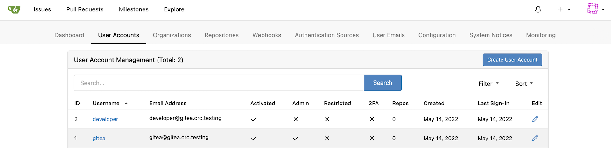
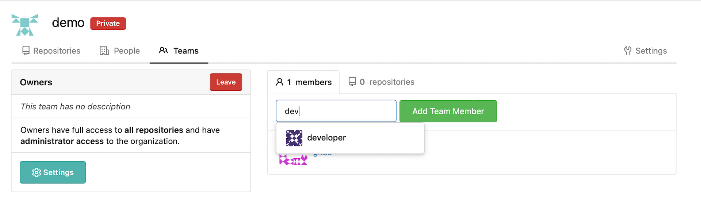

## Set Up The Cluster Resources

First we need to install a Gitea server and a Tekton Interceptor for Gitea

### Install a Gitea server to be our SCM for this demo

   In resources that you cloned I have provided a demo Deployment of Gitea for us to use.  Check out Gitea here: [https://gitea.io/en-us/](https://gitea.io/en-us/){:target="_blank"}

   Let's install that first.  __Note:__ This assumes that you are using Code Ready Containers.  If you are not, then you will need to modify the PersistentVolumeClaim in this YAML file.

   ```bash
   oc new-project gitea
   oc apply -f ~/tekton-tutorial/gitea-demo/gitea-server.yaml -n gitea
   ```

   Create a edge terminated TLS route for Gitea

   ```bash
   oc create route edge gitea --service=gitea-http -n gitea
   ```

### Install the Gitea Tekton Interceptor:

   __Note:__ Log into your OpenShift cluster as a cluster admin for this part.

   If you are using CRC then do this:

   ```bash
   crc console --credentials
   ```

   Use the password in the output to log into the cluster:

   ```bash
   crc login -u kubeadmin https://api.crc.testing:6443
   ```

   Create the Interceptor:

   ```bash
   oc apply -f ~/tekton-tutorial/gitea-demo/gitea-interceptor.yaml -n openshift-pipelines
   ```

   ```bash
   oc create route edge gitea-interceptor --service=gitea-interceptor -n openshift-pipelines
   ```

__Note:__ If you are curious, the code for the Interceptor is here: [https://github.com/cgruver/gitea-interceptor](https://github.com/cgruver/gitea-interceptor)

### Configure Gitea

1. Log into your Gitea server:

   Get the URL for the Gitea route:

   ```bash
   echo "https://$(oc get route gitea -o=jsonpath='{.spec.host}' -n gitea)"
   ```

   Copy that URL into your browser and log into the Gitea server.

   __Note:__ The initial admin user credentials are:

   |User Name:|`gitea`|
   |Password:|`password`|

   You will be prompted to change the admin user's password.

   __Note:__ You also have a developer user, `devuser` who's initial password is also `password`.

1. Select `Site Administration` from the drop down menu in the top right corner:

   

1. Select User Accounts:

   

1. Create a Service Account for our demo:

    

1. Update the service account by unchecking `May Create Organizations`

   

1. Go back to `Site Administration` and select `Organizations`:

   

1. Create an Organization for the demo code:

   

1. From the new Organization, select `View Demo` on the right hand side of the screen:

   

1. From the new Organization, select the `Owners` Team from the `Teams` menu on the right hand of the screen:

   

1. Add your `devuser` account as a Team member:

   

1. Go back to the `demo` Organization and this time select `New Team` from the right hand menu:

   Create a team as shown for the demo service account:

   

1. Go back to the `demo` Organization and select the new `demo-sa` Team from the right hand menu:

   

1. Add the `demo-sa` user to the Team:

   

## Trust the Cluster Cert on the Gitea Route

1. Grab the self-signed certificate from the Gitea Route:

   ```bash
   ROUTE_CERT=$(openssl s_client -showcerts -connect $(oc get route gitea -o=jsonpath='{.spec.host}' -n gitea):443 </dev/null 2>/dev/null|openssl x509 -outform PEM | while read line; do echo "    $line"; done)
   ```

1. Create a ConfigMap in the `openshift-config` namespace

   ```bash
   cat << EOF | oc apply -n openshift-config -f -
   apiVersion: v1
   kind: ConfigMap
   metadata:
     name: demo-ca
   data:
     ca-bundle.crt: |
       # CRC Route Cert
   ${ROUTE_CERT}

   EOF
   ```

1. Patch the default Proxy instance for the OpenShift cluster:

   __Note:__ This will cause Code Ready Containers to stop.  In a real cluster this would be a rolling restart of your nodes.

   ```bash
   oc patch proxy cluster --type=merge --patch '{"spec":{"trustedCA":{"name":"demo-ca"}}}'
   ```

1. Restart Code Ready Containers:

   ```bash
   crc start
   ```

## Install The Pipeline Resources

__Note:__ You will need to be logged in as a cluster administrator for this step

1. Install the provided Templates into the `openshift` namespace:

   ```bash
   oc apply -f ~/tekton-tutorial/gitea-demo/pipeline-manifests/templates/
   ```

1. Install the ClusterTasks:

   ```bash
   oc apply -f ~/tekton-tutorial/gitea-demo/pipeline-manifests/clusterTasks/
   ```

1. Add a Pipeline to our demo app project

   ```bash
   oc apply -f ~/tekton-tutorial/gitea-demo/pipeline-manifests/java-pipeline.yaml
   ```

__[OpenShift Pipelines (Tekton) - Triggers with a cup of Gitea - Demo](/tutorials/tekton-triggers-gitea-demo/)__
