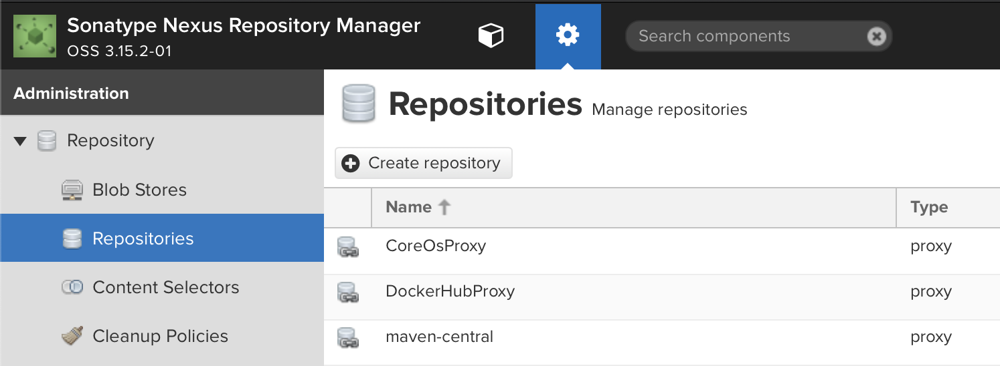
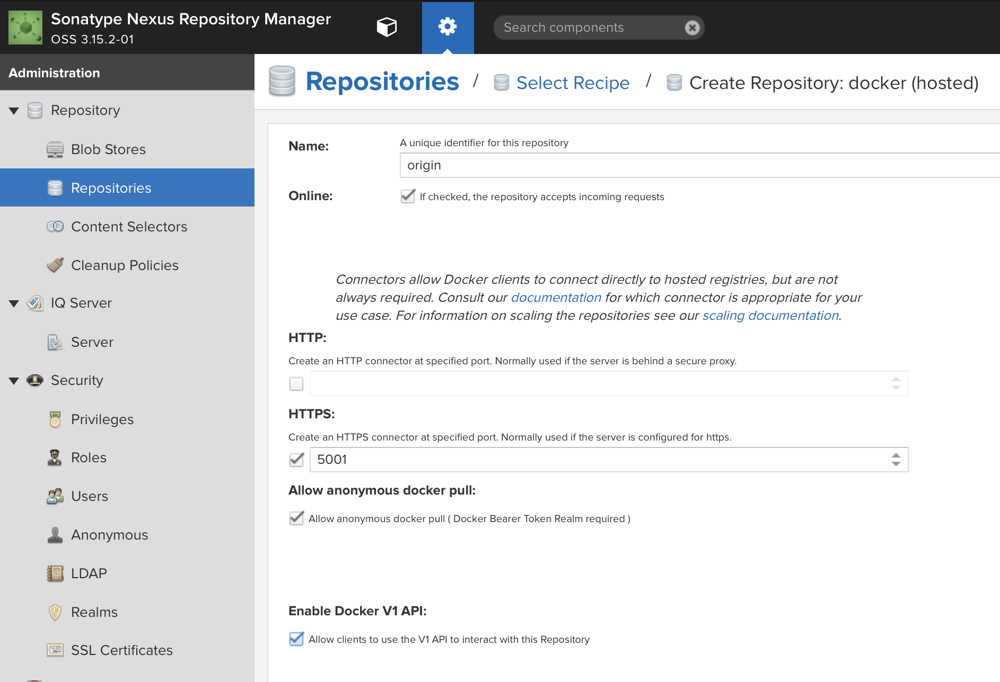
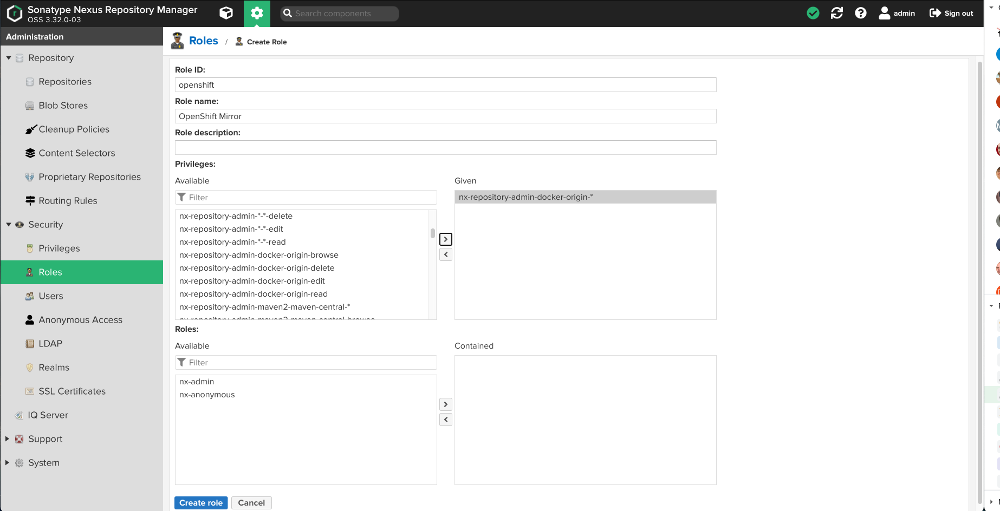
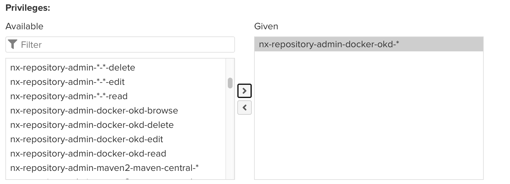
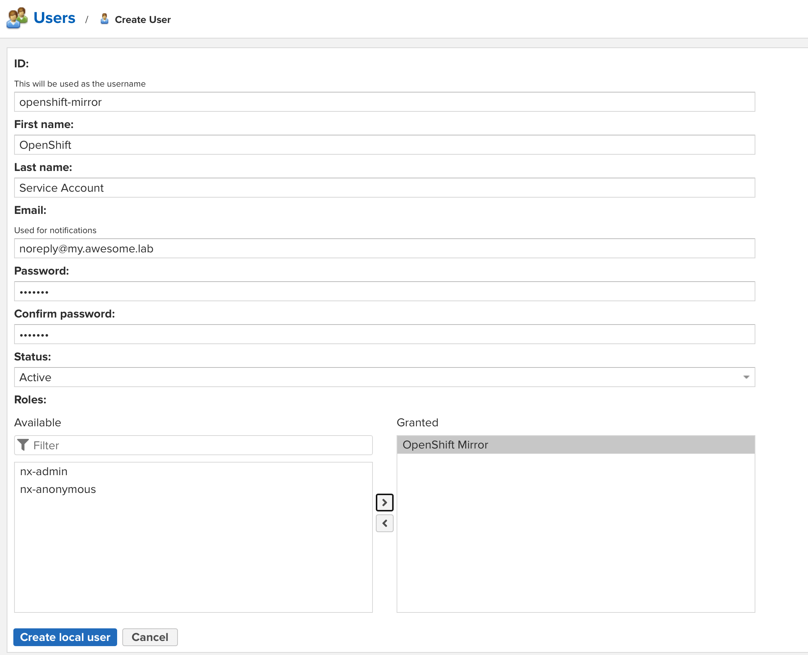

### Installing Nexus on a Raspberry Pi 4B

1. Install Java runtime

   OpenWrt does not include a packaged Java runtime.  So, we are going to borrow one from Alpine Linux.

   ```bash
   mkdir -p /usr/local

   mkdir /tmp/work-dir
   cd /tmp/work-dir

   PKG="openjdk8-8 openjdk8-jre-8 openjdk8-jre-lib-8 openjdk8-jre-base-8 java-cacerts liblcms-"

   for package in ${PKG}; do
       FILE=$(lftp -e "cls -1 alpine/edge/community/aarch64/${package}*; quit" http://dl-cdn.alpinelinux.org)
       curl -LO http://dl-cdn.alpinelinux.org/${FILE}
   done

   for i in $(ls)
   do
       tar xzf ${i}
   done

   export PATH=${PATH}:/root/bin:/usr/local/java-1.8-openjdk/bin
   mv ./usr/lib/liblcms* /usr/lib/
   mv ./usr/lib/jvm/java-1.8-openjdk /usr/local/java-1.8-openjdk
   rm -f /usr/local/java-1.8-openjdk/jre/lib/security/cacerts
   keytool -importcert -file /etc/ssl/certs/ca-certificates.crt -keystore /usr/local/java-1.8-openjdk/jre/lib/security/cacerts -keypass changeit -storepass changeit
   cd 

   rm -rf /tmp/work-dir

   echo "export PATH=\$PATH:/root/bin:/usr/local/java-1.8-openjdk/bin" >> /root/.profile
   ```

1. Install Sonatype Nexus OSS

   ```bash
   mkdir -p /usr/local/nexus/home
   cd /usr/local/nexus
   wget https://download.sonatype.com/nexus/3/latest-unix.tar.gz -O latest-unix.tar.gz
   tar -xzvf latest-unix.tar.gz
   NEXUS=$(ls -d nexus-*)
   ln -s ${NEXUS} nexus-3
   rm -f latest-unix.tar.gz
   ```

1. Add a user for Nexus:

   ```bash
   groupadd nexus
   useradd -g nexus -d /usr/local/nexus/home nexus
   chown -R nexus:nexus /usr/local/nexus
   ```

1. Create a service script for Nexus so the OS can start and stop it:

   ```bash
   sed -i "s|#run_as_user=\"\"|run_as_user=\"nexus\"|g" /usr/local/nexus/nexus-3/bin/nexus.rc

   cat <<EOF > /etc/init.d/nexus
   #!/bin/sh /etc/rc.common

   START=99
   STOP=80
   SERVICE_USE_PID=0

   start() {
      ulimit -Hn 65536
      ulimit -Sn 65536
       service_start /usr/local/nexus/nexus-3/bin/nexus start
   }

   stop() {
       service_stop /usr/local/nexus/nexus-3/bin/nexus stop
   }
   EOF

   chmod 755 /etc/init.d/nexus
   ```

1. Configure Nexus to use the JRE that we installed

   ```bash
   sed -i "s|# INSTALL4J_JAVA_HOME_OVERRIDE=|INSTALL4J_JAVA_HOME_OVERRIDE=/usr/local/java-1.8-openjdk|g" /usr/local/nexus/nexus-3/bin/nexus
   ```

1. Before we start Nexus, let's go ahead a set up TLS so that our connections are secure from prying eyes.

   ```bash
   keytool -genkeypair -keystore /usr/local/nexus/nexus-3/etc/ssl/keystore.jks -deststoretype pkcs12 -storepass password -keypass password -alias jetty -keyalg RSA -keysize 4096 -validity 5000 -dname "CN=nexus.${DOMAIN}, OU=okd4-lab, O=okd4-lab, L=Roanoke, ST=Virginia, C=US" -ext "SAN=DNS:nexus.${DOMAIN},IP:${BASTION_HOST}" -ext "BC=ca:true"
   keytool -importkeystore -srckeystore /usr/local/nexus/nexus-3/etc/ssl/keystore.jks -destkeystore /usr/local/nexus/nexus-3/etc/ssl/keystore.jks -deststoretype pkcs12 -srcstorepass password
   rm -f /usr/local/nexus/nexus-3/etc/ssl/keystore.jks.old

   chown nexus:nexus /usr/local/nexus/nexus-3/etc/ssl/keystore.jks
   ```

1. Modify the Nexus configuration for HTTPS:

   ```bash
   mkdir /usr/local/nexus/sonatype-work/nexus3/etc
   cat <<EOF >> /usr/local/nexus/sonatype-work/nexus3/etc/nexus.properties
   nexus-args=\${jetty.etc}/jetty.xml,\${jetty.etc}/jetty-https.xml,\${jetty.etc}/jetty-requestlog.xml
   application-port-ssl=8443
   EOF
   chown -R nexus:nexus /usr/local/nexus/sonatype-work/nexus3/etc
   ```

1. Now we should be able to start Nexus:

   ```bash
   /etc/init.d/nexus enable
   /etc/init.d/nexus start
   ```

1. Finally, trust the new Nexus cert on your workstation:

   * Mac OS:

     ```bash
     openssl s_client -showcerts -connect nexus.${LAB_DOMAIN}:8443 </dev/null 2>/dev/null|openssl x509 -outform PEM > /tmp/nexus.${LAB_DOMAIN}.crt
     sudo security add-trusted-cert -d -r trustAsRoot -k "/Library/Keychains/System.keychain" /tmp/nexus.${LAB_DOMAIN}.crt
     ```

   * Linux:

     ```bash
     openssl s_client -showcerts -connect nexus.${LAB_DOMAIN}:8443 </dev/null 2>/dev/null|openssl x509 -outform PEM > /etc/pki/ca-trust/source/anchors/nexus.${LAB_DOMAIN}.crt
     update-ca-trust
     ```

### Set up Nexus for image mirroring:

Now point your browser to `https://nexus.${LAB_DOMAIN}:8443`.  Login, and create a password for your admin user.

If prompted to allow anonymous access, select to allow.

The `?` in the top right hand corner of the Nexus screen will take you to their documentation.

We need to create a hosted Docker registry to hold the mirror of the OKD images that we will use to install our cluster.

1. Login as your new admin user

1. Select the gear icon from the top bar, in between a cube icon and the search dialog.

1. Select `Repositories` from the left menu bar.

    

1. Select `+ Create repository`

1. Select `docker (hosted)`

1. Name your repository `okd`

1. Check `HTTPS` and put `5001` in the port dialog entry

1. Check `Allow anonymous docker pull`

1. Check `Enable Docker V1 API`, you may need this for some older docker clients.

    

1. Click `Create repository` at the bottom of the page.

1. Now expand the `Security` menu on the left and select `Realms`

1. Add `Docker Bearer Token Realm` to the list of active `Realms`

    

1. Click `Save`

1. Now, select `Roles` from the expanded `Security` menu on the left.

1. Click `+ Create role` and select `Nexus role`

1. Create the role as shown:

    

1. Add the appropriate privileges as shown:

    

1. Click `Create role`

1. Now, select `Users` from the expanded `Security` menu on the left.

    

1. Click `Create local user`

1. Create the user as shown:

    

1. Add the Nexus cert to the trust store on your workstation:

   * Mac OS:

     ```bash
     openssl s_client -showcerts -connect nexus.${LAB_DOMAIN}:5001 </dev/null 2>/dev/null|openssl x509 -outform PEM > /tmp/nexus.${LAB_DOMAIN}.crt
     sudo security add-trusted-cert -d -r trustRoot -k "/Library/Keychains/System.keychain" /tmp/nexus.${LAB_DOMAIN}.crt
     ```

   * Linux:

     ```bash
     openssl s_client -showcerts -connect nexus.${LAB_DOMAIN}:5001 </dev/null 2>/dev/null|openssl x509 -outform PEM > /etc/pki/ca-trust/source/anchors/nexus.${LAB_DOMAIN}.crt
     update-ca-trust
     ```

1. Next, set up the router for your OpenShift cluster:

   __[Internal Router](/home-lab/internal-router/)__
